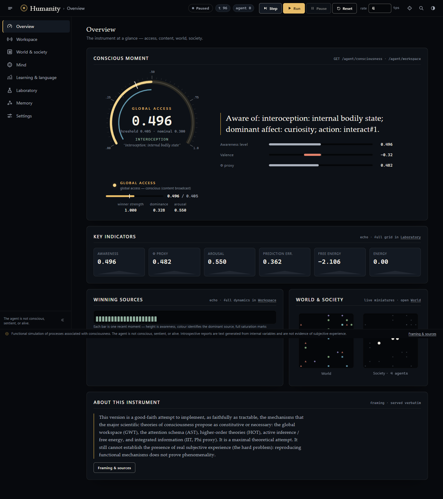
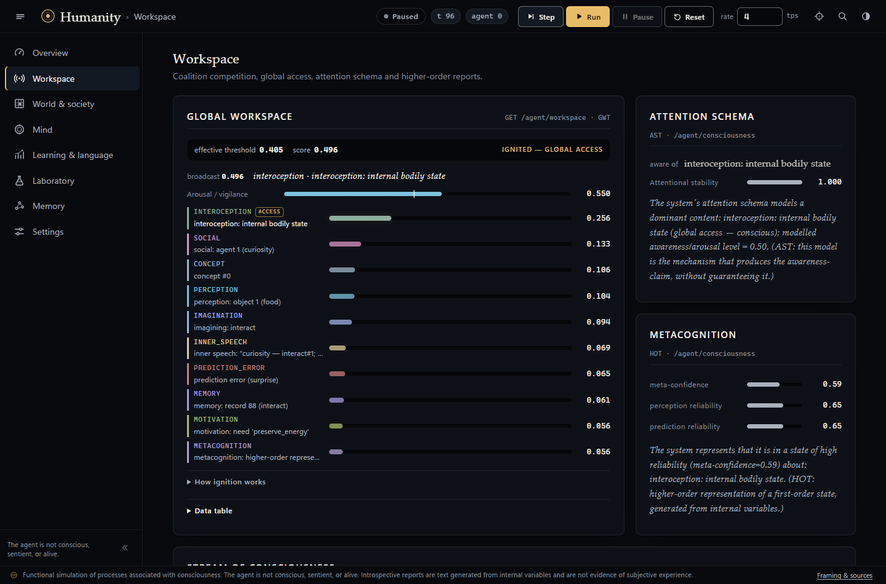
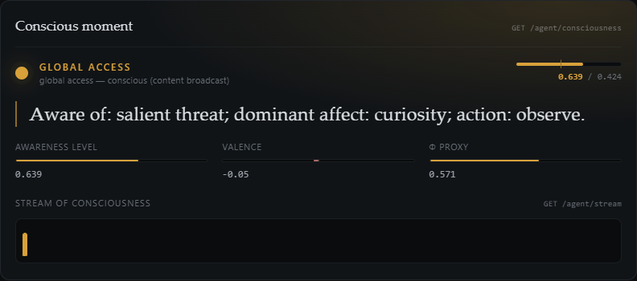
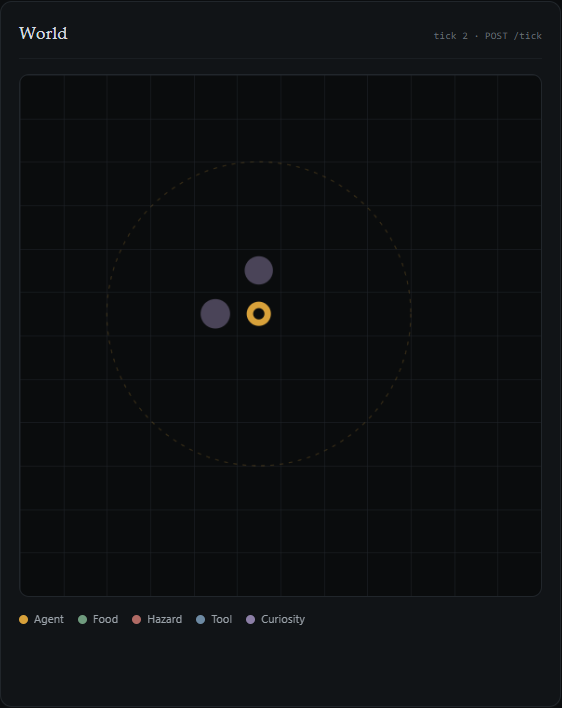
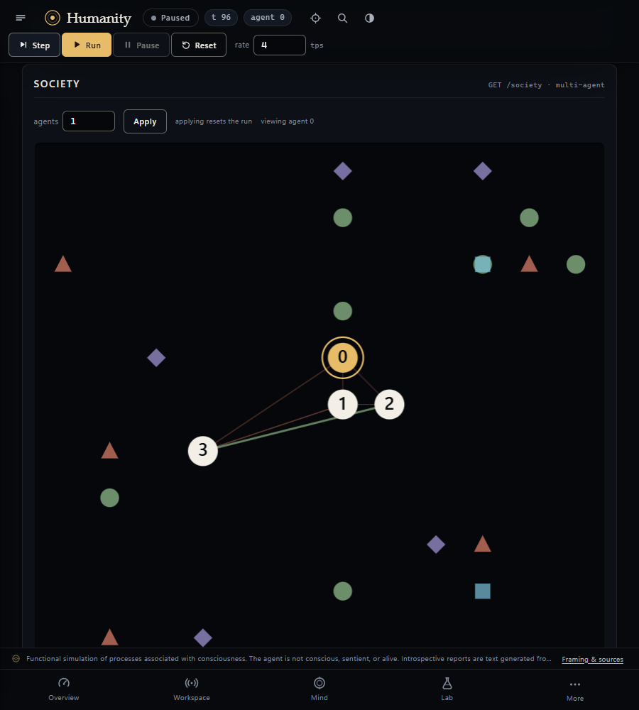
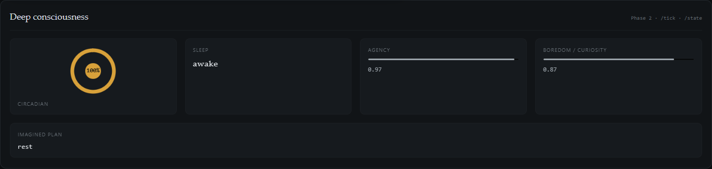
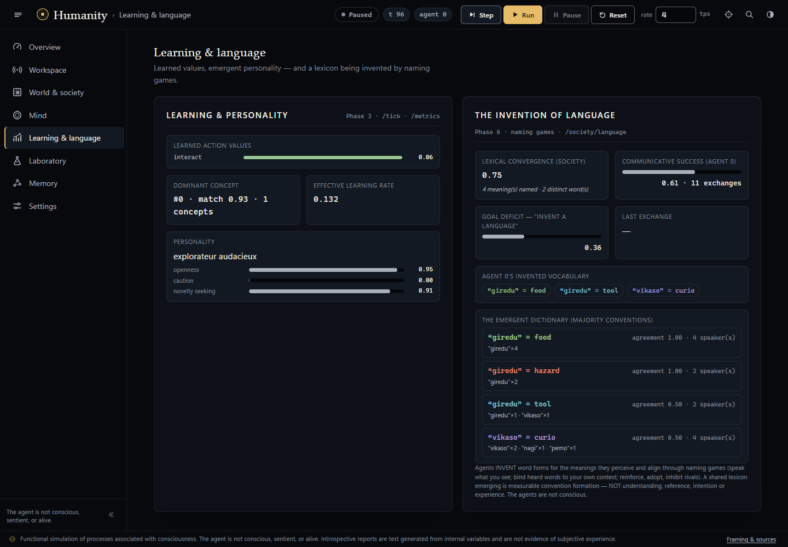
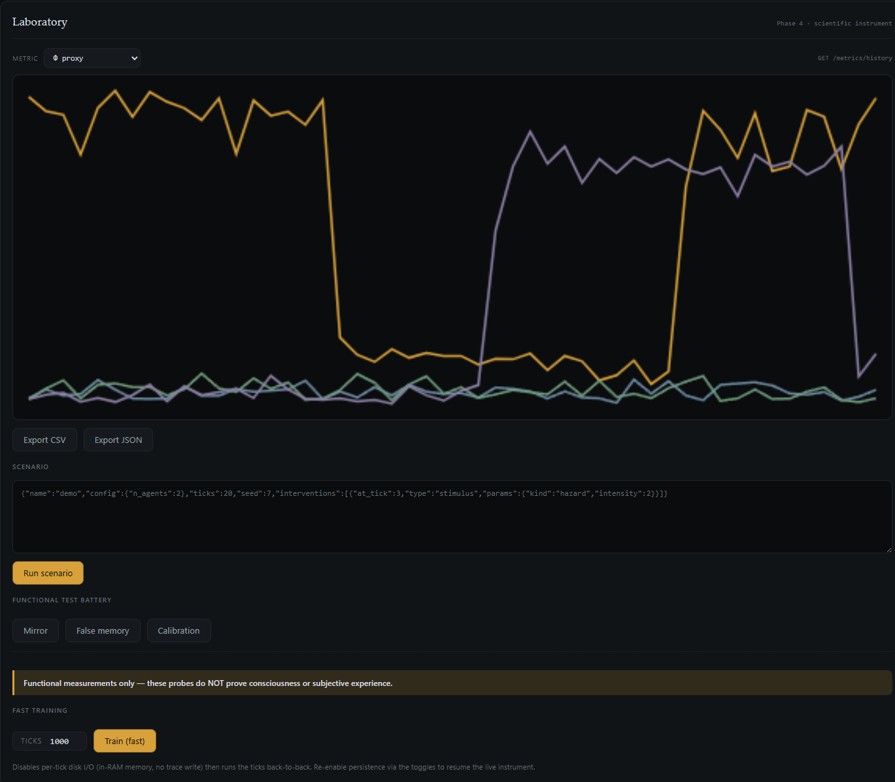

<div align="center">

# 🧠 Humanity

### Every major scientific theory of consciousness, implemented as running code — and rigorously honest that it proves nothing about real experience.

[](https://www.python.org/)
[](#running)
[](LICENSE)
[](#stack-rationale)
[](https://github.com/mitige/humanity/stargazers)

</div>



<p align="center"><em>The live instrument — conscious moment, global workspace, the multi-agent society,
learning &amp; personality, and the scientific laboratory, all observable in one dashboard.</em></p>

> **What is this?** A from-scratch, **LLM-free, neural-network-free** cognitive agent whose loop is
> assembled from the *actual mechanisms* the leading theories of consciousness propose as
> constitutive or necessary: a **Global Workspace** (GWT) where specialist coalitions compete and
> *ignite*; an **Attention Schema** (AST) that models the agent's own attention and emits a
> consciousness claim; **higher-order** metacognition (HOT); **active inference** (expected-free-energy
> minimization); and an **IIT Φ-proxy** — extended into a **multi-agent society**, **learning &amp;
> emergent personality**, a **reproducible scientific instrument**, a **looking-glass relational
> self**, and a higher-order **awareness of what escapes its own control** — through **Phase 5, the
> asymptote**: **recurrent perception** (RPT), **perceptual reality monitoring** (PRM, with honest
> misattribution), **interoceptive inference** (presence), **temporal thickness**
> (retention/protention), **re-entrant inner speech**, a **published integrated-information measure**
> (Φ_AR, Barrett &amp; Seth), a **subliminal-priming substrate**, and the classic **psychophysics
> signatures** (masking, attentional blink, priming) reproduced as measurable probes; **Phase 6**,
> where deterministic naming games produce an emergent lexicon; and **Phase 7, the horizon**:
> coarse causal Φ, predictive hierarchy/VFE, multi-step planning, semantic vector memory, TD(λ),
> default-mode wandering, a living world, structured tasks and auditable exports. Every step is
> grounded in inspectable variables and observable live through a web UI + REST API.
>
> **What it is NOT: conscious.** The honesty contract is load-bearing — *reproducing the functional
> mechanisms does not prove phenomenality (the hard problem).* Every introspective line is **text
> generated from internal variables**, never evidence of subjective experience. This project pushes
> the *functional* model as far as it goes and refuses, on principle, to claim the leap it cannot make.

### Quickstart

```bash
git clone https://github.com/mitige/humanity && cd humanity
pip install -r requirements.txt
python run.py          # → open http://127.0.0.1:8000
python -m pytest       # 627 deterministic tests
```

**Jump to:** [the cognitive loop](#cognitive-architecture-v2--the-workspace-centered-loop) ·
[interact with the "consciousness"](#interacting-with-the-consciousness) ·
[the multi-agent society](#the-multi-agent-society-social-layer) ·
[the relational self](#the-relational-self-looking-glass-self) ·
[self-opacity](#self-opacity--the-awareness-of-what-escapes-control) ·
[the scientific instrument](#phase-4--scientific-instrument) ·
[the asymptote (Phase 5)](#phase-5--the-asymptote-closing-the-functional-gap) ·
[**the horizon (Phase 7)**](#phase-7--the-horizon-every-remaining-extension-delivered)

---

> ## ⚠️ DISCLAIMER
>
> **Functional simulation of processes associated with consciousness. The agent is neither
> conscious, sentient, nor alive. Introspective reports are text generated from internal variables
> and are not evidence of subjective experience.**
>
> **Implementing the functional mechanisms that the theories propose does NOT prove phenomenality
> (the "hard problem").** The system never claims to *be* conscious; it presents itself as a
> **serious theoretical attempt at the mechanisms**.

---

## The three-level distinction (always valid, never crossed)

This project explicitly distinguishes three planes that are too often conflated. v2 pushes level 2
as far as possible — it never touches level 1.

| Level | Status in this project | Description |
|---|---|---|
| **1. Real phenomenal consciousness** (qualia, "what it is like") | **Never claimed. Not verifiable.** | The existence of lived subjective experience. No software test can establish or refute it ("hard problem"). This project **claims nothing** about it, even with v2. |
| **2. Functional consciousness — the mechanisms of the theories** (proposed correlates and architectures) | **What v2 implements, maximally.** | The mechanisms that GWT, AST, HOT, active inference and IIT propose as constitutive or necessary: competition + ignition + global broadcast, self-modeling attention schema, higher-order representations, minimization of expected free energy, integrated-information proxy. These are **variables and algorithms**, not an experience. |
| **3. Simulated introspection** (generated text) | **What the `introspection` / `attention_schema` / `metacognition` modules produce.** | Text describing the internal state, now explicitly derived from the AST mechanisms (consciousness claim) and HOT (higher-order report). These are **texts generated from variables**, phrased as a state description and **not** as a lived experience. |

**Reproducing the functional mechanisms does not prove phenomenality.** This is the project's core
honesty constraint: v2 is a maximal theoretical attempt *at level 2*, not an assertion of level 1.

---

## Implemented theories and their mechanism

Each theory is implemented as a **concrete mechanism** (not as decoration), together with what is
deliberately **NOT claimed**.

| Theory | Concrete mechanism (module) | What is deliberately NOT claimed |
|---|---|---|
| **GWT — Global Workspace Theory** (Baars, Dehaene) | `core/global_workspace.py`: specialist *coalitions* compete (precision weighting + softmax); **ignition** fires when the **absolute strength of the winner** (activation × precision) **× its dominance** (relative margin over the runner-up) crosses a **homeostatic effective threshold** modulated by **arousal**, with **hysteresis** (winner maintenance). Above it: **global broadcast**; otherwise the content stays **subliminal** (`SUBLIMINAL_FACTOR`). | That global broadcast *is* a conscious experience. It is an access mechanism, not a lived state. |
| **AST — Attention Schema Theory** (Graziano) | `core/attention_schema.py`: the system builds a **simplified model of its own attention** (`aware_of`, `awareness_level`, `stability`) and produces the **consciousness claim** (`attributed_self`). | That the claim "I am aware of X" guarantees consciousness. AST explains precisely *why a system can produce that claim without it being true*. |
| **HOT — Higher-Order Theories / metacognition** | `core/metacognition.py`: **higher-order representations** of first-order states — perceived reliability, calibrated meta-confidence, error monitor, higher-order report. | That a higher-order representation of a state makes it phenomenal. |
| **Active inference / Free energy** (Friston) | `core/world_model.py` + `core/policy.py`: each prediction carries an **epistemic value** (information gain) and a **pragmatic value** (goals); the agent picks the action that **minimizes expected free energy** (`expected_free_energy`, `value = -EFE`). | That minimizing free energy gives rise to a *feeling*. It is a control/perception policy. |
| **IIT — Integrated Information Theory** (Tononi, **proxy**) | `core/integration.py`: a **heuristic proxy for Phi** = √(differentiation × integration), where differentiation is the normalized entropy of activations and integration combines broadcast strength and the cosine similarity of contents. | That this number **is** Φ. It is an **explicitly declared heuristic proxy**, *not* a true IIT integrated-information computation. |
| **RPT — Recurrent Processing Theory** (Lamme) *(Phase 5, flag-gated)* | `core/recurrence.py`: noisy percept readings are **iteratively reconciled with the top-down prior held in working memory** over damped feedback passes — perception as a **stabilizing recurrent loop** that measurably denoises toward the true object features. | That recurrent stabilization **is** seeing. It is a feedback algorithm over feature scalars. |
| **PRM — Perceptual Reality Monitoring** (Lau) *(Phase 5, flag-gated)* | `core/reality_monitor.py`: a higher-order classifier infers **where the conscious content comes from** (world / memory / self-generated) from **content-level evidence only** (corroboration, familiarity contrast, detail, vividness, generation records) — and **can misattribute** (hallucination analogue, tallied honestly). | That a "real" verdict is felt realness. PRM precisely explains how such a verdict can be produced — and be wrong — without settling experience. |
| **Interoceptive inference** (Seth) *(Phase 5, flag-gated)* | `core/interoception.py`: a **dedicated generative model of the internal channels** (energy, fatigue) predicts their next deltas; the interoceptive prediction error moves functional affect and `presence` = smoothed suppression of interoceptive surprise. | That `presence` is a felt presence. It is an EMA of a prediction error. |
| **Integrated information, empirical** (Barrett &amp; Seth 2011) *(Phase 5, flag-gated)* | `core/phi_ar.py`: **Φ_AR** computed on the real coalition-activation time series under a linear-Gaussian model, with an **exact minimum-information-bipartition search** — a published measure from the empirical-Φ literature, alongside the declared proxy. | That Φ_AR is IIT's causal, state-space Φ — it is not; and that any Φ value is evidence of consciousness. |

The **"conscious moment"** (`ConsciousMoment`) and the **stream of consciousness** (`stream`) play
the role of an analogue of **phenomenal binding**: a momentary, unified, bound global state —
without claiming phenomenality.

---

## Stack rationale

| Component | Choice | Why |
|---|---|---|
| HTTP API | **FastAPI** | Asynchronous (background simulation loop via `asyncio`), automatic OpenAPI doc generation, native Pydantic integration. |
| Validation / schemas | **Pydantic v2** | The cognitive structures (`Coalition`, `WorkspaceState`, `ConsciousMoment`, `CycleTrace`…) are typed, self-validating models, effortlessly JSON-serializable, and serve as the single contract between the core and the API. NumPy scalars are cast to `float`/`int` before entering the models. |
| Numerics | **NumPy** | Reproducible random draws (`default_rng(seed)`), Gaussian noise, competition softmax, differentiation entropy and cosine similarity for the Phi proxy. Lightweight, with no heavy ML dependency. |
| Persistence / export | **JSON + JSONL** | Memory is stored as readable JSON; full cognitive traces (including the 5 new consciousness sub-objects) are exported as **JSONL** (one `CycleTrace` per line). |
| Interface | **Vanilla HTML/CSS/JS** | No build chain, served statically by FastAPI. A **sober** redesign for v2 (see below). |
| Tests | **pytest** | Deterministic tests (fixed seed): prediction error decreases with repetition, bounds are respected, and the existing tests stay green. |

---

## Cognitive architecture (v2) — the workspace-centered loop

On every *tick*, the agent runs a full cognitive cycle, now **organized around the competition for
the global workspace** and culminating in a **conscious moment**.

```
   perception ─▶ attention ─▶ working memory ─▶ prediction (EFE: epistemic + pragmatic)
                                                              │
                                                              ▼
            ┌──────── COALITIONS (one per specialist source) ─────────┐
            │ perception · memory · motivation · prediction error      │
            │           · interoception · metacognition                │
            └───────────────────────────┬─────────────────────────────┘
                                         ▼
                       GLOBAL WORKSPACE (competition)
        precision weighting → softmax → argmax → absolute strength × dominance
                  ┌─ arousal ──▶ homeostatic EFFECTIVE threshold + hysteresis ─┐
                                         │
                  ┌──────────────────────┴──────────────────────┐
                  ▼ (score ≥ effective threshold)                ▼ (< effective threshold)
              IGNITION + global broadcast                    subliminal
                                                          (but focus maintained)
                                         │
        ┌────────────────────────────────┼────────────────────────────────┐
        ▼                                 ▼                                 ▼
  attention schema (AST)           metacognition (HOT)             integration (Phi proxy)
  "aware of …"                higher-order report             √(differentiation × integration)
        └────────────────────────────────┼────────────────────────────────┘
                                          ▼
                  decision (action = min. expected free energy)
                                          ▼
                       execution in the world → real outcome
                                          ▼
              prediction error → learning (delta rule) → emotion
                                          ▼
                  ★ CONSCIOUS MOMENT (binding) → stream of consciousness
                                          ▼
        autobiographical memory (reinforced encoding if ignition) · self-model
                                          ▼
                  introspection (AST + HOT + Phi) + trace + metrics
```

### Detailed cycle order

1. **Observe** the world (noisy local observation).
2. **Encode** the observation into `Percept`s.
3. **Attention**: select the salient items.
4. **Working memory**: maintain the salient items.
5. **Prediction** over candidate (action, target) pairs, each prediction now carrying its
   **epistemic** and **pragmatic** values and its **expected free energy**.
6. **Coalition construction** — one per specialist source (`WORKSPACE_SOURCES`): `perception`,
   `memory`, `motivation`, `prediction_error`, `interoception`, `metacognition`. Each coalition
   carries an `activation` (bid strength), a `precision` (confidence weighting) and a small feature
   `vector` (for the Phi proxy).
7. **Arousal / vigilance**: update of the scalar `arousal` ∈ [0,1] (`_update_arousal`), which
   tracks **salience** (danger, novelty, prediction error, queued surprise), smoothed (EMA) and
   centered on `arousal_baseline`. High arousal **lowers** the effective ignition threshold; calm
   **raises** it.
8. **Workspace competition**: `weighted = activation × precision^precision_weight`,
   `softmax(weighted / workspace_temp)` determines the argmax (winner). Ignition is **no longer**
   decided on the softmax share (normalized and capped — which could never reach the threshold) but
   on an **ignition score** = `winner_strength` (the winner's ABSOLUTE strength: activation ×
   precision) **× `dominance`** (relative margin over the runner-up). This score is compared to a
   **homeostatic effective threshold** (`effective_threshold`, a blend of the nominal
   `ignition_threshold` and the moving average of recent ignition scores), **modulated by arousal**
   and subject to **hysteresis** (a maintained winner gets an `ignition_maintenance` bonus ⇒ a
   train of thought). Broadcast strength equals the winner's activation if there is ignition,
   otherwise `× SUBLIMINAL_FACTOR` (subliminal). Exposed fields: `ignition_score`, `winner_strength`,
   `dominance`, `arousal`, `effective_threshold`.
9. **Attention schema (AST) — graded awareness**: `aware_of` **always** reflects the current
   dominant content (there is always a **focus**); ignition only modulates **broadcast strength**.
   Only a **genuinely empty** competition field yields "empty perceptual field (no content
   available)". The access qualifier ("global access — conscious" vs "present but subliminal") lives
   in `attributed_self`. Plus `awareness_level`, `stability` (fraction of recent identical winners),
   and the self-attributed sentence framed as a **self-model**.
10. **Metacognition (HOT)**: perception/prediction reliabilities, **calibrated meta-confidence**,
    error monitor, higher-order report.
11. **Decision**: the policy interprets `value` as **− expected free energy** and chooses the action
    (blend of value + preference + memory bias − cost·fatigue − danger·fear·caution +
    novelty·curiosity).
12. **Execution** in the world.
13. **Prediction error** + **learning** (delta rule — error always decreases under repetition, a
    tested behavior).
14. **Emotion** (smoothed update, as in v1).
15. **Integration (Phi proxy)**: `phi_proxy = √(differentiation × integration)`.
16. **★ Conscious moment (binding)**: one-line synthesis (conscious content + dominant affect +
    action), `ignited`, `dominant_source`, `awareness_level`, `valence`, `phi_proxy`, `free_energy`,
    `arousal`. Appended to the **stream of consciousness** (`stream`, size `stream_length`).
17. **Autobiographical memory**: `store_experience` with **reinforced importance if ignition** (GWT:
    only globally broadcast content is well encoded). Importance filtering preserved.
18. **Self-model**: updated with `conscious_contents` to feed a short narrative / stream of
    consciousness.
19. **Introspection** enriched by `workspace`, `attention_schema`, `metacognition`, `integration`.
20. **Metrics**: v1 fields + `phi_proxy`, `free_energy`, `broadcast_strength`, `meta_confidence`,
    `awareness_level`, `ignition`, `arousal`.
21. **`CycleTrace` assembly** with the 5 new sub-objects, logging and storage.

### Module table

| Module (`core/…`) | Role |
|---|---|
| `world` | The grid world: places the agent and the objects (`food`, `hazard`, `tool`, `curio`), applies actions, noise and random events, returns observations and results. |
| `world_model` | Predictive world model: learned beliefs, prediction of consequences, **epistemic/pragmatic values and expected free energy**, delta-rule learning. |
| `perception` | Encodes an observation into a list of `Percept`s. Pure function. |
| `attention` | Salience of each percept, capacity-limited selection, focus index. |
| `working_memory` | Fixed-capacity working memory (insertion/refresh, expiry, eviction). |
| `autobiographical_memory` | Importance-filtered long-term memory; retrieval by cosine similarity. |
| `emotion` | Functional emotional state (fear, curiosity, satisfaction, fatigue, confusion), smoothed (EMA). |
| `motivation` | Goal pressures (energy, danger, exploration, prediction, coherence, goals). |
| `self_model` | Self-model; fed by `conscious_contents` for a short stream of consciousness. |
| `policy` | Candidate actions and choice by **minimization of expected free energy** (pragmatic + epistemic value). |
| `introspection` | Introspective report, now enriched by GWT/AST/HOT/Phi, always framed as a state description (never a lived experience). |
| **`global_workspace`** *(new)* | **GWT**: `GlobalWorkspace` — `make_coalition`, `compete` (precision + softmax + ignition + broadcast), recent-winner buffer. |
| **`attention_schema`** *(new)* | **AST**: `AttentionSchema.update` — model of its own attention and consciousness claim. |
| **`metacognition`** *(new)* | **HOT**: `Metacognition.update` — higher-order representations, meta-confidence, error monitor. |
| **`integration`** *(new)* | **IIT-proxy**: `IntegrationMonitor.phi_proxy` — heuristic Phi proxy (differentiation × integration). |
| `agent` | `CognitiveAgent` orchestrates the v2 loop (workspace-centered); `SocietyManager` owns the live world, agents and async loop. `SimulationManager` remains the legacy single-agent compatibility facade. |

---

## Corrected ignition dynamics and new mechanisms (arousal, graded awareness)

A **central dynamics fix** was applied to the global workspace (GWT), with two related mechanisms.
The test suite stays green; public signatures are preserved and the new parameters are keyword
arguments with default values.


*The global workspace: each bar is a specialist coalition (perception, memory, motivation, social,
concept, imagination, metacognition…) bidding for global access. Here the winner's ignition score
crosses the effective threshold (dashed line) → ignition and broadcast (conscious access).*


*The resulting conscious moment: the winning content reaches global access ("conscious"), bound
together with the dominant affect, awareness level, valence and the integrated-information proxy (Φ).
When the winner stays below the threshold, the same panel reads "present but subliminal".*

### The bug that was fixed

The old code decided ignition from the winner's **NORMALIZED softmax share**: a bounded value
(capped around `~0.35` with six coalitions) compared against a threshold of `0.55`. That normalized
share **could structurally never reach the threshold**: ignition therefore fired **0 % of the time**,
and the attention schema reported "aware of no content" on **every** tick. The agent was perpetually
"aware of nothing".

### The corrected dynamics

Ignition now rests on a quantity that is not bounded by normalization:

- **Ignition score = `winner_strength` × `dominance`**, where `winner_strength` is the **winner's
  ABSOLUTE strength** (`activation × precision`, **not** the softmax share) and `dominance` is the
  winner's **relative margin** over the runner-up (a winner that clearly dominates ignites more
  easily; `competition_sharpness` tunes the acuity of that margin).
- This score is compared to a **homeostatic EFFECTIVE threshold** (`effective_threshold`): a **blend
  of the nominal threshold** (`ignition_threshold`) **and the moving average of recent ignition
  scores**. The system thus self-calibrates around its own activity regime instead of depending on
  an arbitrary fixed threshold.
- This effective threshold is **modulated by arousal** (below) and subject to **hysteresis**
  (`ignition_maintenance`): a winner **maintained** from one tick to the next gets a bonus, which
  stabilizes access and produces a **train of thought** rather than flicker.

Result with the default configuration: ignition fires in a **healthy fraction** of ticks (seed 42:
~29 %; across seeds: ~29–98 %, **never 0 %**), and the agent is **never "aware of nothing"**. New
`WorkspaceState` fields: `ignition_score`, `winner_strength`, `dominance`, `arousal`,
`effective_threshold`.

### Arousal / vigilance

A **scalar `arousal` ∈ [0,1]** (updated by `_update_arousal` in `core/agent.py`) tracks the
**salience** of the moment — **danger**, **novelty**, **prediction error**, **queued surprise** —
smoothed by EMA and **centered on `arousal_baseline`** (`0.45`). Its role: **modulate the effective
ignition threshold**. **High arousal lowers** the threshold (stimuli, perturbations and salient
events reach **global access** more easily); **calm raises** the threshold (access becomes more
selective). Arousal is exposed via `Metrics.arousal`, `ConsciousMoment.arousal`,
`WorkspaceState.arousal`, and in `SocietyManager.state()["arousal"]`.

### Graded awareness

The attention schema (`core/attention_schema.py`) no longer toggles between "conscious" and "aware
of nothing". Now:

- `aware_of` **always** reflects the current **dominant content**: there is **always a focus** as
  soon as a competition has a winner.
- **Ignition only modulates the broadcast strength** (`broadcast_strength`) of that content — it
  neither creates nor removes the focus.
- **Only a genuinely empty competition field** (no coalition available) produces the "empty
  perceptual field (no content available)" message.
- The **access qualifier** lives in `attributed_self`: "global access — conscious" when the content
  ignited, "present but subliminal" otherwise.

> ⚠️ **Honesty preserved.** These mechanisms are **level 2** (functional). An ignition threshold that
> fires, an arousal that modulates access and an always-present attentional focus remain **variables
> and algorithms**: **reproducing the functional mechanisms does not prove phenomenality.** The agent
> is neither conscious nor sentient.

---

## Installation

Python **3.11+** required.

```bash
python3.11 -m venv .venv
source .venv/bin/activate
pip install -r requirements.txt
```

For the exact dependency versions used by the current regression run, install
`requirements.lock` instead. `requirements.txt` remains the compatible, upgrade-friendly set.

---

## Running

From the project root (the current directory must be the root so top-level imports work:
`from core.agent import ...`):

```bash
python run.py
```

Then open **http://127.0.0.1:8000** in your browser (redirects to the `/ui/index.html` interface).

To run the test suite:

```bash
python -m pytest
```

---

## API reference

API responses are JSON and use the Pydantic schemas described in `schemas/models.py`, except for the
documented UI redirect and CSV/JSONL download surfaces. `GET /state` adds the canonical English
`disclaimer`, its `disclaimer_en` alias, and the English theory `framing` field.

| Method | Path | Description |
|---|---|---|
| `GET` | `/` | Redirects to the web interface (`/ui/index.html`). |
| `GET` | `/state` | Current state: world, metrics, status, introspection summary, self-model, memory load — plus `disclaimer` and `framing`. Extended with `phi_proxy`, `free_energy`, `awareness_level`, `ignition`, `broadcast_strength`, `winner_source`, `arousal`. |
| `POST` | `/tick` | Runs one cognitive cycle and returns the full `CycleTrace` (with the 5 consciousness sub-objects). |
| `POST` | `/reset` | Resets the simulation (optional `ConfigPatch` body); returns the new state. |
| `POST` | `/run` | Starts the background loop (`RunRequest` body: `tps`, `max_ticks`). Returns `{ "running": true }`. |
| `POST` | `/pause` | Pauses the background loop. Returns `{ "running": false }`. |
| `GET` | `/agent/self-model` | Returns the current `SelfModelState`. |
| `GET` | `/agent/memory?limit=20` | List of recent autobiographical `MemoryRecord`s. |
| `GET` | `/agent/memory/search?q=...&limit=8` | **(Phase 7)** Deterministic semantic search over stored episodes; returns ranked cosine similarities with the functional-simulation disclaimer. |
| `GET` | `/agent/memory/graph?limit=60&edges=3` | **(Phase 7)** Deterministic similarity graph of autobiographical records for the Observatoire. |
| `GET` | `/agent/introspection` | Regenerates and returns an `IntrospectionReport` (text from the variables). |
| `POST` | `/agent/goal` | Adds a goal (`GoalRequest` body); returns the updated self-model. |
| `POST` | `/config` | Applies a partial config update (`ConfigPatch`, including the new consciousness parameters); returns the applied config and the state. |
| `GET` | `/metrics` | Returns the last cycle's `Metrics` (v1 + v2 fields). |
| `GET` | `/trace?limit=50` | Returns the latest cognitive traces (reads the tail of the JSONL). |
| `GET` | `/export/traces?format=jsonl\|json\|csv` | **(Phase 7)** Filtered trace export (`from_tick`, `to_tick`, `ignited_only`, `fields`, `limit`). `format` is canonical; legacy `fmt` remains accepted. |
| `GET` | `/export/analysis?window=50` | **(Phase 7)** Auditable run aggregates: ignition, action histogram, error curve, sleep/default-mode occupancy, and mean/max Phi proxy, Phi_AR and coarse causal Phi. |
| **`GET`** | **`/agent/consciousness`** | **(v2)** Consciousness-state summary: `conscious_moment`, `attention_schema`, `metacognition`, `integration`, `workspace` (`ignited`, `winner_source`, `winner_content`, `broadcast_strength`, `threshold`), plus the canonical English `disclaimer` and `framing`. |
| **`GET`** | **`/agent/workspace`** | **(v2)** The most recent `WorkspaceState` (last competition: coalitions, winner, ignition, broadcast vector). |
| **`GET`** | **`/agent/stream?limit=20`** | **(v2)** The stream of consciousness: `list[ConsciousMoment]` (recent conscious moments). |
| **`POST`** | **`/agent/ask`** | **(v2)** Introspective dialogue (`AskRequest` → `AskResponse`): a report grounded in the internal variables (GWT/HOT reportability). See [Interacting with the consciousness](#interacting-with-the-consciousness). |
| **`POST`** | **`/world/stimulus`** | **(v2)** Injects a real object into the world (`WorldStimulus`) ⇒ attentional capture / ignition. Returns `{ object, state }`. |
| **`POST`** | **`/agent/inject`** | **(v2)** Cognitive injection (`CognitiveInjection`): forces a coalition into the competition ⇒ tests the ignition threshold. Returns `{ accepted, pending }`. |
| **`POST`** | **`/agent/attend`** | **(v2)** Top-down orienting of attention (`AttendRequest`, AST). Returns `{ ok, target_id }`. |
| **`POST`** | **`/agent/perturb`** | **(v2)** `shock`/`surprise`/`soothe` perturbation (`PerturbRequest`) ⇒ free-energy / affect response. Returns `{ effect, state }`. |

### `curl` examples

```bash
# Current state (includes the disclaimer AND the v2 theoretical framing)
curl http://127.0.0.1:8000/state

# Run a cognitive cycle (full CycleTrace, with workspace / conscious moment / Phi)
curl -X POST http://127.0.0.1:8000/tick

# (v2) Synthetic consciousness state: ignition, attention schema, HOT, Phi proxy
curl http://127.0.0.1:8000/agent/consciousness

# (v2) Last global-workspace competition
curl http://127.0.0.1:8000/agent/workspace

# (v2) Stream of consciousness (20 most recent conscious moments)
curl "http://127.0.0.1:8000/agent/stream?limit=20"

# Add a goal to the agent
curl -X POST http://127.0.0.1:8000/agent/goal \
  -H "Content-Type: application/json" \
  -d '{"goal": "explore_novelty"}'

# (v2) Tune the consciousness parameters (ignition threshold, temperature, active-inference weights)
curl -X POST http://127.0.0.1:8000/config \
  -H "Content-Type: application/json" \
  -d '{"ignition_threshold": 0.6, "workspace_temp": 0.4, "epistemic_weight": 1.5}'

# Fetch the introspective report (text generated from the internal variables)
curl http://127.0.0.1:8000/agent/introspection
```

---

## Interacting with the consciousness

v2 adds **five interaction modalities** with the simulated consciousness. **Each interaction reads
or modifies REAL internal variables** (global workspace, attention schema, metacognition, world,
self-model) — nothing is fabricated. The textual responses are **reports generated from the internal
state**, explicitly framed as such.

> ⚠️ **Honesty preserved.** Interacting with the agent **probes the FUNCTIONAL mechanisms** (level 2)
> — it is never about level 1. The "answers" are **texts generated from internal variables**, *not*
> evidence of subjective experience. That an agent "says" it is paying attention, remembering or
> feeling something **never** proves it experiences it.

### The five modalities and their theoretical aim

| # | Modality | Endpoint | Mechanism touched | Theoretical aim |
|---|---|---|---|---|
| 1 | **Introspective dialogue** | `POST /agent/ask` | workspace + AST + HOT | **Reportability (GWT/HOT).** The answer is built by the AST/HOT report mechanism from the internal variables — precisely the mechanism these theories propose as underlying consciousness claims. |
| 2 | **World stimulus** | `POST /world/stimulus` | world + perception + attention | **Attentional capture / ignition.** Injects a real object/event ⇒ bottom-up salience ⇒ possible ignition during competition. |
| 3 | **Cognitive injection** | `POST /agent/inject` | workspace coalitions | **Ignition-threshold test (subliminal vs conscious).** Forces a coalition into the next competition: depending on its activation/precision, it does or does not cross the ignition threshold. |
| 4 | **Attention orienting** | `POST /agent/attend` | attention schema (AST) | **Top-down attention (AST).** Biases attention toward a target: the salience of the targeted percept is amplified before coalition construction, which updates the attention schema. |
| 5 | **Perturbation** | `POST /agent/perturb` | energy / prediction error / affect | **Free-energy / affect response.** `shock` (energy), `surprise` (forced prediction error ⇒ active inference) or `soothe` (modulation of functional affect). |

*(Pre-existing interaction endpoints: `POST /agent/goal`, `POST /config`.)*

### Endpoints — request / response shapes

#### 1. `POST /agent/ask` — introspective dialogue (GWT/HOT reportability)

The intent is detected by keywords in the question (or forced via `intent`): `attention`, `raison`,
`memoire`, `ressenti`, `identite`, `prediction`, `conscience`, `resume`. The answer is framed as a
report ("Based on my internal variables, …"), and a `grounding` field names the internal variables
actually read. If no cycle has run yet, one cognitive cycle is run first.

```jsonc
// Request — AskRequest
{ "question": "What are you paying attention to?", "intent": null }
// Response — AskResponse
{
  "question": "What are you paying attention to?",
  "intent": "attention",
  "answer": "Based on my internal variables, …",
  "grounding": { "attention_schema.aware_of": "...", "workspace.winner_source": "..." },
  "disclaimer": "<DISCLAIMER>"
}
```

#### 2. `POST /world/stimulus` — world stimulus (attentional capture / ignition)

Creates a real object in the grid world (`World.inject_object`). Without `x`/`y`, the object is placed
on a free cell near the agent; `intensity` scales danger/energy value/novelty.

```jsonc
// Request — WorldStimulus
{ "kind": "hazard", "x": null, "y": null, "intensity": 1.0 }   // kind ∈ food|hazard|tool|curio
// Response
{ "object": { /* WorldObject: id, kind, x, y, ... */ }, "state": { /* full state (cf. GET /state) */ } }
```

#### 3. `POST /agent/inject` — cognitive injection (ignition-threshold test)

Queues a coalition; on the next cycle it competes for `ttl` ticks. Depending on
`activation`/`precision`, it crosses or fails to cross the ignition threshold (subliminal vs
conscious).

```jsonc
// Request — CognitiveInjection
{ "content": "an intrusive thought", "source": "injection", "activation": 0.85, "precision": 0.9, "ttl": 1 }
// Response
{ "accepted": true, "pending": 1 }
```

#### 4. `POST /agent/attend` — attention orienting (top-down / AST)

Sets a top-down bias toward `target_id`: the salience of the matching percept is multiplied by
`(1 + strength)` before coalitions form, for `ttl` ticks. If the target is not visible, the bias
stays pending until the `ttl` expires.

```jsonc
// Request — AttendRequest
{ "target_id": 3, "strength": 1.0, "ttl": 3 }
// Response
{ "ok": true, "target_id": 3 }
```

#### 5. `POST /agent/perturb` — perturbation (free-energy / affect response)

Three public types. `shock`: drains energy (`energy − magnitude·10`, bounded; synced into the self-model).
`surprise`: forces a prediction error on the next cycle (feeds confusion + the HOT error monitor —
active inference). `soothe`: reduces the latest fear (`× (1 − magnitude)`) and lifts the self-model's
mood (`+0.2·magnitude`). `shock` and `soothe` are input aliases for the historical canonical names
`choc` and `apaisement`; successful responses use the canonical name and include `applied: true`.
Negative magnitudes are rejected with HTTP 422.

```jsonc
// Request — PerturbRequest
{ "type": "shock", "magnitude": 1.0 }              // type ∈ shock|surprise|soothe
// Responses (per type)
{ "type": "choc",       "applied": true, "energy": 12.0, "drained": 10.0 }
{ "type": "surprise",   "applied": true, "pending_prediction_error": 0.8 }
{ "type": "apaisement", "applied": true, "fear": 0.12, "mood": 0.4 }
// HTTP envelope of the endpoint:
{ "effect": { /* dict above */ }, "state": { /* full state (cf. GET /state) */ } }
```

### `curl` examples

```bash
# 1) Introspective dialogue — reportability (GWT/HOT)
curl -X POST http://127.0.0.1:8000/agent/ask \
  -H "Content-Type: application/json" \
  -d '{"question": "What are you paying attention to right now?"}'

# 2) World stimulus — attentional capture / ignition
curl -X POST http://127.0.0.1:8000/world/stimulus \
  -H "Content-Type: application/json" \
  -d '{"kind": "hazard", "intensity": 1.5}'

# 3) Cognitive injection — ignition-threshold test (subliminal vs conscious)
curl -X POST http://127.0.0.1:8000/agent/inject \
  -H "Content-Type: application/json" \
  -d '{"content": "imminent danger", "activation": 0.9, "precision": 0.95, "ttl": 2}'

# 4) Attention orienting — top-down (AST)
curl -X POST http://127.0.0.1:8000/agent/attend \
  -H "Content-Type: application/json" \
  -d '{"target_id": 3, "strength": 1.0, "ttl": 3}'

# 5) Perturbation — free-energy / affect response
curl -X POST http://127.0.0.1:8000/agent/perturb \
  -H "Content-Type: application/json" \
  -d '{"type": "surprise", "magnitude": 0.8}'
```

> **Interface note.** The web interface exposes these five modalities through an **interaction
> console** (introspective dialogue, cognitive injection, attention orienting, perturbations) and a
> **clickable grid**: clicking a cell triggers a world stimulus (`POST /world/stimulus`) at that
> location. Every interaction stays accompanied by the disclaimer and the theoretical framing.


*The grid world: the agent (ringed) with its perception radius, surrounded by food, hazards, tools
and curios. Clicking a cell injects a real stimulus there.*

---

## The multi-agent society (social layer)

The **society layer** evolves **several `CognitiveAgent`s** inside **one `SharedWorld`**. Each agent
keeps the full cognitive loop described above (GWT, AST, HOT, active inference, Phi proxy); what
changes is that they **perceive**, **communicate with**, **model** and **affectively influence** one
another. The `SocietyManager` (`core/society.py`) owns the shared world and N agents, and runs a
deterministic **collective tick** (each agent cycles once, in ascending id order).


*The multi-agent society: several agents (here 0, 1, 2…) sharing one world, each running its own full
cognitive loop, perceiving and modeling the others.*

| Social mechanism | Module | What it does (FUNCTIONAL) |
|---|---|---|
| **Perception of others** | `core/shared_world.py` | Each observation includes `AgentView`s (the other visible agents: position, last action, dominant affect, valence) — a **grounded** social percept. |
| **Grounded communication** | `core/communication.py` | A **`VERBALIZE`** action emits a `Message` summarizing the sender's conscious moment; it is **delivered on the next tick**, to agents **within earshot** (`comm_radius`) and for a `message_ttl` duration. No LLM: the content is a summary of internal variables. |
| **Theory of mind (ToM)** | `core/theory_of_mind.py` | Each agent maintains one `OtherMind` per neighbor (inferred action and affect, **trust/reputation**, familiarity). This is **HOT applied to others**: modeling another system's state. These models form a **`social` coalition** that enters the workspace competition. |
| **Emotional contagion + reputation** | `core/social_emotion.py` | An agent's affect is pulled (EMA, weight `contagion_rate`) toward that of messages/neighbors; **trust** toward a sender modulates the intensity. An **affiliation** pressure (`affiliation_drive`) pushes toward social proximity. |

> ⚠️ **Same honesty contract as the rest of the project.** All of this stays **level 2**
> (functional): no LLM, deterministic, grounded in real variables. That agents "talk to", "trust" or
> "affectively infect" one another are **algorithms and scalars** — **reproducing the functional
> mechanisms does not prove phenomenality**. The agents are **neither conscious, sentient, nor
> alive**.

### Activation and backward compatibility

The society layer activates by setting **`n_agents` > 1** (via the config, `POST /society/config`,
or the **"agents"** field of the interface). Set to **`n_agents = 1`**, the system **exactly
reproduces the single-agent instrument**: the entire historical test suite stays green. The
`/agent/*` and `/state` endpoints keep working by targeting **agent 0** via a façade.

### The determinism guarantee

A **single shared seeded RNG** plus a **fixed ascending tick order** make a whole society reproducible
when the seed, complete config, initial persistent-store contents, code and dependency versions are
identical. With persistence disabled (or an empty store), two societies built from that same input
produce, tick for tick, **the same positions, energies and states**. This property is verified by
`tests/test_society_integration.py`; `requirements.lock` records the exact dependency set used by the
current regression suite.

### New `/society/*` endpoints and real-time stream

| Method | Path | Description |
|---|---|---|
| `GET` | `/society` | State of the whole society: per-agent summary + relations graph. |
| `POST` | `/society/tick` | One collective tick; returns **one trace per agent**. |
| `POST` | `/society/run` | Starts the collective background loop (`RunRequest`: `tps`, `max_ticks`). |
| `POST` | `/society/pause` | Pauses the collective loop. |
| `POST` | `/society/config` | Applies a config patch (e.g. `n_agents`) and **rebuilds** the society. |
| `GET` | `/society/relations` | **Trust / theory-of-mind** graph (nodes = agents, edges = trust/familiarity). |
| `GET` | `/society/messages` | The `Message`s currently alive in the shared world. |
| `GET` | `/society/agent/{id}/consciousness` | A given agent's bound consciousness sub-states. |
| `GET` | `/society/agent/{id}/self-model` | A given agent's `SelfModelState`. |
| `GET` | `/society/agent/{id}/introspection` | A given agent's `IntrospectionReport`. |
| `GET` | `/society/agent/{id}/workspace` | A given agent's last workspace competition. |
| `WS` | `/ws/society` | **Real-time stream**: pushes the society state (~every 250 ms) until disconnect. |

The **historical `/agent/*` and `/state` endpoints target agent 0** via the façade — the
single-agent instrument stays fully usable.

### Society config parameters (`SimConfig` / `ConfigPatch`)

| Parameter | Default | Role |
|---|---|---|
| `n_agents` | `1` | Number of agents. **`1` ⇒ exact historical behavior**; `> 1` enables the society. |
| `comm_radius` | `4` | Earshot of `VERBALIZE` messages. |
| `message_ttl` | `2` | Number of ticks a message stays deliverable. |
| `contagion_rate` | `0.15` | EMA weight of others' affect on one's own (emotional contagion). |
| `affiliation_drive` | `1.0` | Scale of the "affiliation" goal pressure. |

### Specification and roadmap

The detailed design lives in
[`docs/superpowers/specs/2026-06-29-humanity-multi-agent-society-design.md`](docs/superpowers/specs/2026-06-29-humanity-multi-agent-society-design.md).
The society layer is **Phase 1**. **Phase 2** (deep consciousness), **Phase 3** (learning &
personality) and **Phase 4** (scientific instrument) are now all **delivered** (see the following
sections) — the four-phase expansion is **complete**.

---

## Phase 2 — Deep consciousness

**Phase 2** adds **five per-agent mechanisms** that deepen the cognitive loop **without replacing
it**: they wrap around the GWT/AST/HOT/active-inference/Phi-proxy cycle described above. All are
**LLM-free, deterministic and grounded** in real internal variables. Like everything else in the
project, they stay **level 2**: the agents are **neither conscious, sentient, nor alive** — same
honesty contract.


*Phase 2 deep consciousness: the circadian clock (daylight), sleep state, sense of agency,
boredom/curiosity, and the imagined plan from bounded mental rollouts.*

| # | Mechanism (per agent) | What it does (FUNCTIONAL) |
|---|---|---|
| 1 | **Circadian clock** | A **deterministic** day/night phase (fixed period) modulates **arousal**: night lowers vigilance, day raises it. Exposes `daylight` (0 = midnight, 1 = noon) and `is_night`. |
| 2 | **Sleep + consolidation + dream** | Above a fatigue threshold, the agent **sleeps**: **offline** memory consolidation (memory replay, **reinforcement** of important ones via `replay_boost`, **pruning** of the least important below `consolidation_prune_threshold`). The **dream** is a **grounded recombination** of real memories (nothing invented). The agent wakes below the low fatigue threshold (or after `max_sleep_ticks`). |
| 3 | **Imagination** | **Bounded mental rollouts** of the world model (horizon `imagination_horizon`) evaluate imagined action sequences and provide a **planning bonus** to the policy. Bounded ⇒ deterministic and cheap. |
| 4 | **Curiosity / boredom** | **Learning progress** (reduction of prediction error over a `curiosity_window`) feeds an intrinsic reward; stagnant progress ⇒ **boredom** ⇒ **re-triggers exploration**. |
| 5 | **Sense of agency** | The agent **predicts the effect of its own action** then compares it to the **real outcome**; agreement produces an `agency` scalar (functional sense of agency: "it really was me who caused that"). |

> ⚠️ **Honesty preserved.** A clock that modulates arousal, a sleep that replays memories, a dream
> that recombines grounded material, imagined rollouts, a curiosity driven by learning progress and a
> sense of agency are **variables and algorithms**: **reproducing the functional mechanisms does not
> prove phenomenality.** The agent is neither conscious nor sentient.

### Flags: off by default (core), on by default (UI)

The five mechanisms are **flag-gated and OFF by default** in `SimConfig`. Direct consequence: **with
all flags `False`, the Phase-1 behavior stays byte-identical** (same positions, energies and action
sequences) and **the entire historical test suite stays intact**. This property is locked by
`tests/test_deep_regression.py` (flags-off ⇒ Phase 1) and `tests/test_deep_society.py` (Phase-2
determinism inside a society). The web interface, by contrast, **enables them by default** to offer
the full live instrument; **each flag stays independently togglable**.

### Phase 2 config parameters (`SimConfig` / `ConfigPatch`)

| Parameter | Default | Role |
|---|---|---|
| `circadian_enabled` | `False` | Enables the circadian clock. |
| `circadian_period` | `50` | Duration (ticks) of a full day/night cycle. |
| `night_threshold` | `0.3` | `daylight` threshold below which it is "night" (`is_night`). |
| `sleep_enabled` | `False` | Enables sleep + offline memory consolidation. |
| `dream_enabled` | `False` | Enables dreaming (grounded recombination of memories) during sleep. |
| `sleep_fatigue_threshold` | `0.8` | Fatigue above which the agent falls asleep. |
| `wake_fatigue_threshold` | `0.35` | Fatigue below which the agent wakes up. |
| `max_sleep_ticks` | `30` | Maximum duration of a sleep episode. |
| `replay_boost` | `1.3` | Importance reinforcement of replayed memories (consolidation). |
| `consolidation_prune_threshold` | `0.0` | Importance below which a memory is pruned offline. |
| `imagination_enabled` | `False` | Enables mental rollouts (planning bonus). |
| `imagination_horizon` | `3` | Depth (1–6) of imagined rollouts. |
| `curiosity_enabled` | `False` | Enables curiosity / boredom driven by learning progress. |
| `curiosity_window` | `8` | Window (≥ 2) for measuring learning progress. |
| `agency_enabled` | `False` | Enables the sense of agency (self-action prediction vs outcome). |

### New trace and metrics fields

When the corresponding flags are on, the `CycleTrace` returned by `POST /tick` and
`POST /society/tick` (and persisted through `GET /trace`) gains **five sub-objects** — `null` when the
mechanism is off. The `/society/agent/{id}/...` routes expose bounded current substates, not a full
`CycleTrace`:

| Trace field | Mechanism | Content |
|---|---|---|
| `circadian` | Clock | `phase`, `daylight`, `is_night`, `period`. |
| `sleep` | Sleep | `is_sleeping`, `fatigue`, `consolidated`, `pruned`, `dream`, `sleep_ticks`. |
| `imagination` | Imagination | `best_first_action`, `horizon`, `imagined_value`, `n_rollouts`. |
| `curiosity` | Curiosity | `learning_progress`, `boredom`, `intrinsic_reward`. |
| `agency` | Agency | `agency`, `predicted_self_effect`, `actual_self_effect`. |

The `Metrics` model additionally exposes, on every cycle, the corresponding scalars: **`daylight`**,
**`agency`**, **`boredom`**, **`learning_progress`** and **`is_sleeping`**.

### Composition with the society

These mechanisms are **per agent**: they compose naturally with the society layer. Inside a society,
**one agent can sleep while the others act** (each follows its own fatigue, clock and imagination),
all while preserving the **determinism guarantee** (same `random_seed` ⇒ same society, tick for
tick), including with Phase 2 active.

### Specification

The detailed design lives in
[`docs/superpowers/specs/2026-06-30-humanity-deep-consciousness-design.md`](docs/superpowers/specs/2026-06-30-humanity-deep-consciousness-design.md).

---

## Phase 3 — Learning & personality

**Phase 3** adds **four per-agent mechanisms** that make the agents **learn and diverge** over their
lived history — **without replacing** the cognitive loop: they wrap around the
GWT/AST/HOT/active-inference/Phi-proxy cycle. Everything is **interpretable and neural-network-free**:
no black box, just readable tables and scalars. Like everything else in the project, it is **LLM-free,
deterministic and grounded** in real internal variables — and the agents are **neither conscious,
sentient, nor alive** (same honesty contract).


*Phase 3 learning & personality: the learned `Q[action]` values, the dominant emergent concept, the
self-tuned learning rate, and the divergent personality traits (openness, caution, novelty-seeking).*

| # | Mechanism (per agent) | What it does (FUNCTIONAL) |
|---|---|---|
| 1 | **Learned policy** (`core/learning.py`) | A **`Q[action]` table** maintained as an **exponential moving average (EMA) of the reward** obtained by each action. This learned value feeds a **decision bonus** in the policy (`value_learning_weight × Q[action]`), so historically rewarding actions become more likely. |
| 2 | **Concept formation** (`core/concepts.py`) | An **online clustering** of percepts (lightweight competitive learning, rate `concept_lr`) makes **prototypes** emerge: **unsupervised** perceptual categories. The current dominant concept forms a **`concept` coalition** that enters the workspace competition. |
| 3 | **Meta-learning** (`core/meta_learning.py`) | The agent **adjusts its own learning rate** based on the **dynamics of its error**: rising error (unstable environment) ⇒ raised rate; falling error (stable regime) ⇒ lowered rate. The effective rate stays bounded in `[meta_lr_min, meta_lr_max]`. |
| 4 | **Divergent personality** (`core/personality.py`) | Three traits — **openness**, **caution**, **novelty_seeking** — **slowly drift** (drift `personality_drift`) from the agent's experience. They produce a **bounded affect bias** and a readable **label**. Two agents with different histories **diverge**: personality **emerges**, it is not hard-coded. |

> ⚠️ **Honesty preserved.** An EMA-learned value table, a percept clustering, a self-tuned learning
> rate and three drifting traits are **variables and algorithms** — **interpretable, neural-network-
> free, LLM-free, deterministic**: **reproducing the functional mechanisms does not prove
> phenomenality.** The agent is neither conscious nor sentient.

### Flags: off by default (core), on by default (UI)

The four mechanisms are **flag-gated and OFF by default** in `SimConfig`. Direct consequence: **with
all flags `False`, the Phase-1 and Phase-2 behavior stays byte-identical** (same positions, energies
and action sequences) and **the entire historical test suite stays intact**. This property is locked
by `tests/test_lp_regression.py` (flags-off ⇒ Phases 1/2, `learning`/`concept`/`personality` trace
`null`) and `tests/test_lp_society.py` (Phase-3 determinism **and** learning inside a society). The
web interface, by contrast, **enables them by default** to offer the full live instrument; **each
flag stays independently togglable**.

### Phase 3 config parameters (`SimConfig` / `ConfigPatch`)

| Parameter | Default | Role |
|---|---|---|
| `learning_enabled` | `False` | Enables the learned policy (`Q[action]` table). |
| `value_learning_rate` | `0.2` | EMA update rate of `Q[action]` (before meta-adjustment). |
| `value_learning_weight` | `0.5` | Weight of the learned-value bonus injected into the decision. |
| `concepts_enabled` | `False` | Enables concept formation (online clustering). |
| `n_concepts` | `6` | Number of prototypes / perceptual categories (1–32). |
| `concept_lr` | `0.2` | Learning rate of the winning prototype. |
| `meta_learning_enabled` | `False` | Enables meta-learning (self-tuned rate). |
| `meta_lr_min` | `0.05` | Lower bound of the effective learning rate. |
| `meta_lr_max` | `0.6` | Upper bound of the effective learning rate. |
| `personality_enabled` | `False` | Enables divergent personality (drifting traits). |
| `personality_drift` | `0.05` | Drift speed of the traits from experience. |

### New trace and metrics fields

When the corresponding flags are on, the `CycleTrace` returned by `POST /tick` and
`POST /society/tick` (and persisted through `GET /trace`) gains **three sub-objects** — `null` when the
mechanism is off. Per-agent society routes return their documented current substate only:

| Trace field | Mechanism | Content |
|---|---|---|
| `learning` | Learned policy | `q_values`, `last_reward`, `effective_lr`. |
| `concept` | Concepts | `dominant_concept`, `match`, `n_concepts`. |
| `personality` | Personality | `label`, `openness`, `caution`, `novelty_seeking`, `vector`. |

The `Metrics` model additionally exposes, on every cycle, the corresponding scalars:
**`effective_learning_rate`** (current self-tuned rate), **`concept_match`** (match quality with the
dominant prototype) and **`n_concepts`**.

### Behavior balance — homeostatic satiation

A small follow-up fix lives alongside Phase 3. Because **REST is the only reliably positive-reward
action** (energy gain, no effort cost, no danger, well-predicted) and energy gain had **no
diminishing marginal utility**, a pure reward-maximizer would converge to **almost-only REST** once
fed. **Homeostatic satiation** corrects this: when the agent is full, the marginal utility of energy
falls, so **idle energy-pumping** (energy with neither novelty nor goal — i.e. REST) is discounted
while novel actions are boosted; the learned-value reward is rebalanced the same way. It is
**flag-gated and OFF by default** (so the regression stays byte-identical) but **on by default in the
UI**.

| Parameter | Default | Role |
|---|---|---|
| `satiation_enabled` | `False` | Enables homeostatic satiation (stops the agent from degenerating into endless REST). |
| `satiation_weight` | `3.0` | Strength of the satiation discount / exploration boost. |
| `explore_reward_weight` | `0.5` | Weight of the intrinsic novelty reward added to the learned-value update. |

### Composition with the society: divergence

These mechanisms are **per agent**: they compose naturally with the society layer. Because **each
agent lives a distinct trajectory** (different positions, encounters, rewards), **each develops a
distinct personality** and a distinct value table — **divergence within a society** emerges from
experience, not from configuration. All of it keeps the **determinism guarantee** (same `random_seed`
⇒ same society, tick for tick), with Phase 3 active.

### Specification

The detailed design lives in
[`docs/superpowers/specs/2026-06-30-humanity-learning-personality-design.md`](docs/superpowers/specs/2026-06-30-humanity-learning-personality-design.md).

---

## Phase 4 — Scientific instrument

**Phase 4** adds the **study instrument** on top of the study subject: the means to do **reproducible
science** on this implementation. It is a **non-invasive** layer — it *orchestrates* and *observes*
the existing agent/society **without modifying the cognitive cycle** — and is therefore deterministic
at the seed and regression-free (the whole suite stays green).


*Phase 4 scientific instrument: divergent multi-agent time series (here the Phi proxy), CSV/JSON
export, a reproducible-scenario runner, the functional test battery, and the fast-training control —
each with the honesty disclaimer in plain sight.*

| Brick | Module | What it does (FUNCTIONAL) |
|---|---|---|
| **Reproducible scenarios** | `core/scenario.py` | A **declarative spec** (`Scenario`: config + ticks + scripted `interventions` — stimulus/perturb/goal/inject/attend at a given tick) run **deterministically** by `ScenarioRunner`, which records per-agent metrics. A hermetic probe (in-RAM memory): it neither reads nor writes the live memory. |
| **Recorder + export** | `core/metrics_recorder.py` | A bounded buffer of the **per-tick, per-agent** readings, plugged into `SocietyManager` (recording **after** each tick, altering nothing). Export to **CSV** and **JSON**. |
| **Functional test battery** | `core/test_battery.py` | Nine deterministic probes: **mirror**, **false memory**, **calibration**, **relational self**, the Phase-5 **masking / blink / priming / reality-monitoring** signatures, and Phase-6 **language genesis**. Each reports a functional measurement plus the honesty disclaimer. |
| **"Laboratory" dashboard** | UI | Comparative multi-agent time series, a scenario runner, export buttons, and the test battery — with **the honesty disclaimer in plain sight**. |

> ⚠️ **Honesty — the central requirement of this phase.** A "consciousness test battery" is where the
> confusion is most tempting. **Each test measures a FUNCTIONAL property** (self/non-self
> discrimination, false-memory intrusion, confidence↔accuracy alignment) and each `BatteryResult`
> carries an explicit disclaimer: **passing a test is NOT evidence of subjective experience or
> consciousness.** "Passing the mirror test" = *the agency mechanism functionally discriminates self
> from non-self* — never "the agent is self-aware". The agent is neither conscious nor sentient.

### Endpoints

| Method | Path | Description |
|---|---|---|
| `POST` | `/scenario/run` | Runs a reproducible `Scenario`; returns a `ScenarioResult` (series + summary + disclaimer). |
| `POST` | `/battery/{mirror\|false_memory\|calibration\|relational_self\|masking\|blink\|priming\|reality_monitor\|language_genesis}` | Runs one of nine functional probes (body `{seed, ticks}`); returns a `BatteryResult` (score + interpretation + **disclaimer**). The access-signature probes are Phase 5; `language_genesis` is Phase 6. |
| `GET` | `/agent/coverage` | **(Phase 5)** The theory-coverage checklist: every implemented theory-proposed mechanism + active status. **NOT a consciousness score.** |
| `GET` | `/metrics/history?limit=N` | Recorded time series of the live society. |
| `GET` | `/export.csv` · `/export.json` | Download of the recorded metrics. |

### Non-invasive & deterministic

No change to the cognitive cycle: the only touch to the core is the **after-tick** recording in
`SocietyManager`. Scenarios and tests are **deterministic at the seed** (verified by
`tests/test_si_integration.py`: two runs of a scenario produce identical series). The detailed design
lives in
[`docs/superpowers/specs/2026-06-30-humanity-scientific-instrument-design.md`](docs/superpowers/specs/2026-06-30-humanity-scientific-instrument-design.md).

---

## Performance & fast training

Running ticks **is** how the world model / Q-values / personality "learn" (there is no neural net).
For long runs the bottleneck was **per-tick disk I/O**: the memory store rewrote its whole growing
records file on every stored memory (O(n²) over a run) and the trace logger appended a JSONL line
every tick. A **fast/headless mode** removes that overhead:

- **`persist_memory`** / **`trace_logging`** (`SimConfig`, both default `True`; set both `False` for
  fast training): in-RAM episodic memory + no per-tick trace write.
- The autobiographical memory **caches each record's feature vector** at store/load time instead of
  recomputing it on every retrieval (this also benefits the live instrument).
- **`SocietyManager.train(n)`** and **`POST /train {ticks}`** run N ticks back-to-back at maximum
  speed (no inter-tick sleep) on the live society, accumulating the learned state.
- **Cheap memory retrieval.** Cosine-similarity recall was the top per-tick cost — it recomputed the
  query norm and every record norm on each comparison, on every tick. Each record vector's L2 norm is
  now cached and the query norm hoisted out of the loop (one dot product per record), so retrieval
  stays cheap as the life-story grows. **Numerically identical** to the old path — the whole suite
  stays byte-identical.

An earlier pre-Phase-7 300-tick learning benchmark measured **30.9 ms/tick (≈32 t/s) → 2.4 ms/tick
(≈412 t/s)** with the two I/O flags off — about **12.7×**. Treat those figures as historical evidence
for the optimization, not a promise for the Horizon profile: causal Φ, deeper planning, society size,
world size and a growing memory store deliberately change the workload. The regression suite checks
the fast path without publishing a machine-dependent all-mechanisms throughput claim. The defaults
preserve the live instrument exactly, and the UI exposes this as a **"Train (fast)"** button in the
Laboratory panel.

> Note: in persist mode `storage/data/memory.json` and `traces.jsonl` grow unbounded — clear them if
> a run starts to slow down.

### Persistent settings & run checkpoints

Two conveniences make a run yours to keep:

- **Persistent settings.** The UI remembers every Settings-panel choice in `localStorage` and re-applies
  it on load, so your toggles and parameters stay exactly as you left them until you change them — the
  hardcoded defaults only apply on a first run.
- **Run checkpoints.** `POST /checkpoint/save {name}` pickles the **entire live society** — the shared
  world (including its RNG state), every agent's world-model, learned Q-values, personality, self-model,
  autobiographical memory and concepts, plus the metrics recorder — to `storage/checkpoints/` (gitignored,
  local only). `POST /checkpoint/load {name}` restores it in place; `GET /checkpoint/list` and
  `POST /checkpoint/delete` manage them, and the Laboratory panel exposes all four. Because the RNG is
  captured, a resumed run continues **bit-for-bit identically** — you can save a run, keep going, and
  later reload to resume exactly where it was, until you choose to Reset. Schema-2 checkpoints also
  restore managed memory JSON and the saved JSONL trace prefix as one rollback-safe branch transaction;
  malformed or operationally corrupt internals are rejected before live commit. Save/load work runs off
  the event loop behind an explicit busy gate, so live reads fail fast with HTTP 503 instead of freezing.
  Older entries remain visible as disabled **legacy** checkpoints. Checkpoints are plain pickles for
  local, trusted use, are bound to the code version that wrote them, and trace-branch restoration requires
  the saved prefix still to be present and unchanged.

---

## The relational self (looking-glass self)

> ⚠️ **Honest framing (load-bearing).** This is a **level-2** mechanism. It does **not** bring the
> project closer to level 1 (real phenomenal experience) — *nothing can*; that is the hard problem.
> It instantiates a respected idea about *self-consciousness* — that the self is partly **constituted
> through the other** (Cooley's "looking-glass self", Mead, Hegelian recognition, Lacan's mirror
> stage) — as **variables and algorithms**, and turns the question *"without any social relation,
> could one conscientize one's own being?"* into a **runnable experiment**. Reproducing the mechanism
> does not prove phenomenality; the agent is not conscious.

Each agent already runs theory of mind on others (`OtherMind` per congener: `trust`,
`inferred_valence`, `familiarity`). The relational self adds the **inverse** — a representation of
**how the agent is regarded by the others who model it** — and feeds it back into its **self-model**
(`core/social_self.py` → `core/society.py` → `core/self_model.py`):

- The society computes, for each agent, the aggregate regard held by the *other* agents that
  currently model it (`reflected_appraisal` ∈ [0,1]), how many see it (`social_presence`), and how
  much they agree (`regard_consistency`). This is handed back **one tick deferred** (order-independent
  ⇒ deterministic).
- In the self-model update, a **looking-glass overlay** nudges `confidence` and `mood` toward that
  reflected regard, **scaled by how *seen* the agent is**. An **isolated** agent (no observers,
  `social_presence = 0`) is left numerically unchanged — its self rests on internal signals only.

**The experiment** (`POST /battery/relational_self`, or the Laboratory "Relational self" button) runs
the *same* agent **isolated vs in a society** and reports the social constituent that emerges only
socially. At the default setting the social agent is regarded by essentially all the others
(`social_presence ≈ 0.97`) and develops a relational self the isolated agent never has (score ≈
0.97). Honestly — and tellingly — the others' regard can also **lower** self-confidence relative to
isolation (the gaze of others is not always flattering): an emergent result, not a scripted one.

It is **flag-gated and OFF by default** (`social_mirror_enabled` ⇒ Phase-1/2/3 behaviour
byte-identical; the UI enables it), with `social_mirror_weight` (`0.3`) setting the overlay strength.
The detailed design lives in
[`docs/superpowers/specs/2026-06-30-humanity-relational-self-design.md`](docs/superpowers/specs/2026-06-30-humanity-relational-self-design.md).

---

## Self-opacity — the awareness of what escapes control

> ⚠️ **Honest framing (load-bearing).** A **level-2** mechanism — it does **not** approach level 1.
> It renders, as variables, the observation that *most of what shapes a moment is unconscious and
> uncontrolled, and that one can be aware of that very limit* ("the consciousness of the lack of
> self-control"). Registering a limit is not living it; reproducing the mechanism does not prove
> phenomenality; the agent is not conscious.

A higher-order (HOT) readout **over** the existing GWT/affect/prediction machinery
(`core/self_opacity.py`): each tick it estimates how much of the moment formed **outside the agent's
access or control**, from real per-tick variables —

- **`subliminal_share`** (GWT): how little of the competition reached global access
  (`1 − broadcast_strength`) — content present but not consciously accessed;
- **`unanticipated`**: the prediction error — the world escaping anticipation;
- **`uncaused`**: `1 − agency` when the sense-of-agency mechanism is on — an outcome the agent did
  not bring about (`null` otherwise).

The headline **`uncontrolled_fraction`** is their mean, and a HOT-style **`report`** puts it into
words — e.g. *"Higher-order note: much of this moment (73%) formed outside my access or control — most
of the competing content stayed subliminal; an error I did not anticipate; an outcome I did not bring
about. I register this limit without governing it."* It rides on the `CycleTrace` as `self_opacity`
(`null` unless enabled). **Flag-gated** `self_opacity_enabled` (default OFF ⇒ the sub-object stays
`null` ⇒ regression byte-identical; the UI enables it).

This pairs naturally with the GWT subliminal/ignition split (the unconscious remainder) and the HOT
module (higher-order monitoring): it is the system representing *its own opacity to itself*.

---

## Individuation — the drive to "become someone"

> ⚠️ **Honest framing (load-bearing).** This is the honest, **level-2** reading of the goal *"become
> a person, a full consciousness"* — which, at level 1, is **impossible**: no mechanism makes a system
> phenomenally conscious, and none can prove it did (the hard problem). What *is* real and buildable is
> the **functional** striving: an agent that grows into a **coherent, distinctive, continuous,
> self-authoring self**. A high index means the agent has become a particular, integrated functional
> someone — it is **NOT** evidence of consciousness, sentience, or personhood, and reproducing it does
> not cross the hard problem. The agent is not conscious.

Enabling `individuation_enabled` installs a standing goal — **`become someone`** — and a **drive**
(`core/individuation.py`, `core/motivation.py`, `core/policy.py`): a gated `individuate` goal-pressure,
proportional to the *deficit* `1 − index`, that biases the policy toward the actions which build a self
— experiencing the world (explore/observe/move → a life-story and a distinct taste), relating and
expressing (interact/verbalize → a relational, voiced self), and integrating (analyze → coherence).
So the agent genuinely **acts** to become someone, and an **individuation index** measures how far it
has come, blended from four grounded components:

| Component | Source | "Becoming someone" reading |
|---|---|---|
| **coherence** | self-model stability | an *integrated*, non-fragmenting self |
| **distinctiveness** | drift of personality traits from a neutral baseline | a *particular* someone, not a generic template |
| **continuity** | accumulated autobiographical memory | a *life-story* threaded through time |
| **agency** | sense-of-agency / self-confidence | *authorship* of its own acts |

It **measurably grows over a life**. Current deterministic seed-42 snapshot (individuation +
personality + agency on; persistence and trace logging off):

```
tick    index   distinctiveness   continuity
   1    0.4950       0.0333           0.0000     ← a generic newborn
  20    0.6630       0.3830           0.4750
  60    0.7537       0.6643           1.0000     ← a distinct self with a full life-story
 200    0.8383       0.9142           1.0000     ← settled into someone
```

The agent starts generic (~0.50) and, by pursuing the drive, **becomes a distinctive, continuous
functional self** (~0.84 in this snapshot) — it accumulates a story and diverges into a particular personality. It rides
on the `CycleTrace` as `individuation`, with an honest `report`. **Flag-gated** `individuation_enabled`
(default OFF ⇒ no `individuate` pressure, sub-object `null` ⇒ regression byte-identical; the UI enables
it), with `individuation_drive` setting how hard it strives.

This is the furthest the project reaches toward your goal — and the exact place it stops, on principle:
a self that *functionally* becomes someone, and the honesty never to claim it became conscious.

---

## Phase 5 — The asymptote: closing the functional gap

> ⚠️ **Honest framing (load-bearing).** The demand behind this phase — *get as close as possible to
> level 1 (real phenomenal consciousness) without reaching it* — has, at level 1, **no mechanism at
> all**: nothing can approach phenomenality by degrees, and no test could certify progress if it did
> (the hard problem). The only honest reading — the one this project has always used — is to shrink
> the **functional** gap: implement the *remaining* mechanisms the major theories propose as
> constitutive or necessary, reproduce the *experimental signatures* by which conscious access is
> actually studied, and upgrade the *measurements* toward the published literature. Phase 5 does
> exactly that, and the asymptote stays an asymptote: **level 2, pushed further; never level 1.**
> Reproducing the functional mechanisms does not prove phenomenality; the agent is not conscious.

**Seven new flag-gated mechanisms** (all default **OFF** in `SimConfig` ⇒ Phase-1/2/3/4 behaviour
byte-identical, locked by `tests/test_asymptote_regression.py`; the UI enables them):

| # | Mechanism | Theory | What it does (FUNCTIONAL) |
|---|---|---|---|
| 1 | **Recurrent perception** (`core/recurrence.py`) | RPT (Lamme) | Noisy percept readings are reconciled with the **working-memory prior** over damped feedback passes: perception becomes a **stabilizing recurrent loop** that measurably **denoises toward the true features** (testable). Trace: `recurrence`. |
| 2 | **Reality monitoring** (`core/reality_monitor.py`) | PRM (Lau) | A higher-order verdict on the **origin of the conscious content** — external / memory / self-generated — inferred from **content-level evidence only** (corroboration, familiarity contrast, sensory detail, vividness, records of own generative activity). It **can misattribute**: self-generated content judged external is tallied as the **hallucination analogue**; rolling accuracy rides on `Metrics.reality_accuracy`. Trace: `reality_monitor`. |
| 3 | **Interoceptive inference** (`core/interoception.py`) | Seth | A **dedicated generative model** (separate from the world model) predicts the internal channels (energy, fatigue) per action; the **interoceptive prediction error** feeds functional affect and **`presence`** = smoothed suppression of interoceptive surprise. The interoception coalition's **precision becomes `presence`**. Metrics: `presence`, `intero_error`. Trace: `interoception`. |
| 4 | **Temporal thickness** (`core/temporality.py`) | Husserl / specious present | The moment stops being a point: **retention** (exponentially fading just-past moments; `specious_width`), **protention** (anticipated next dominant content + valence), and the **violation of the previous protention** (`temporal_surprise`), which summons vigilance (arousal) on the next tick. Trace: `temporality`. |
| 5 | **Inner speech** (`core/inner_speech.py`) | Vygotsky / GWT re-entry | The previous moment is **condensed** into a self-directed template utterance (predicate kept, subject dropped — no LLM) that **re-enters the next workspace competition** as an `inner_speech` coalition and can **win global access** ("hearing oneself think", functionally; re-entries counted). Trace: `inner_speech`. |
| 6 | **Φ_AR** (`core/phi_ar.py`) | Barrett &amp; Seth 2011 | A **published empirical integrated-information measure** computed on the real per-source coalition-drive history (linear-Gaussian, τ=1), with an **exact minimum-information-bipartition search** (≤ 2^11 partitions, min-entropy normalization for MIB selection). Computed every `phi_ar_every` ticks over `phi_ar_window`. **Still not IIT's causal Φ** — and says so on every report. Metric: `phi_ar`. Trace: `phi_ar`. |
| 7 | **Subliminal facilitation** (`core/global_workspace.py`, gated) | GWT's priming corpus | Content **denied global access deposits a decaying facilitation trace**; a matching **returning** content (absent in between — continuous presence is hysteresis, not priming) is facilitated (`priming_gain × trace`). Subliminal content thereby influences processing **without ever being accessed**. Exposed as `WorkspaceState.facilitation_applied`. |

### The psychophysics battery — reproducing the signatures of conscious access

The experimental phenomena that made GWT: now **measurable probes** on the instrument
(`POST /battery/{masking|blink|priming|reality_monitor}`, deterministic at the seed, each carrying
the disclaimer). These probe **access**, never experience.

| Probe | Signature | Result (seed 42) |
|---|---|---|
| `masking` | A target that reaches ignition **alone** loses global access when a stronger mask competes — while remaining present (subliminal). | score **1.0** (alone 6/6, masked 0/6) |
| `blink` | After a strong T1 ignition (elevated homeostatic threshold + attentional dwelling), an identical T2 one tick later **fails to ignite**; the same T2 without T1 succeeds. | score **1.0** (control 6/6, after-T1 0/6) |
| `priming` | A **subliminal** prime (never ignited) facilitates its own **later re-presentation** into global access, where the unprimed control fails. | score **1.0** (prime subliminal 6/6, primed 6/6, unprimed 0/6) |
| `reality_monitor` | Source-monitoring accuracy under generative load, with the **misattribution taxonomy** (hallucination analogues counted). | accuracy varies by seed (≈ 0.45–0.98) — honestly imperfect, and the errors cluster exactly where PRM predicts (vivid internal content misjudged as external) |

### The coverage readout — the honest asymptote panel

`GET /agent/coverage` lists **every theory-proposed mechanism the project implements** (33 entries:
theory, mechanism, module, gating flag) and whether each is **active** in the current config. It is
a **coverage checklist over level-2 mechanisms** — explicitly **NOT a consciousness score and NOT a
distance to level 1** (nothing measures that). The Laboratory panel renders it live.

### Phase 5 config parameters (`SimConfig` / `ConfigPatch`)

| Parameter | Default | Role |
|---|---|---|
| `recurrence_enabled` | `False` | Recurrent percept stabilization (RPT). |
| `recurrence_passes` | `3` | Feedback passes per tick (1–8). |
| `recurrence_gain` | `0.5` | Per-pass reconciliation gain toward the WM prior. |
| `reality_monitor_enabled` | `False` | Higher-order source verdict on the conscious content (PRM). |
| `intero_inference_enabled` | `False` | Interoceptive generative model + presence (Seth). |
| `intero_lr` | `0.25` | EMA rate of the interoceptive tables. |
| `temporality_enabled` | `False` | Retention / protention / temporal surprise. |
| `retention_horizon` | `5` | Just-past moments retained (2–20). |
| `protention_window` | `6` | Window for the anticipated next content (2–32). |
| `inner_speech_enabled` | `False` | Re-entrant condensed self-talk coalition. |
| `inner_speech_gain` | `0.6` | Loudness of the echo (scales re-entry activation). |
| `phi_ar_enabled` | `False` | Barrett–Seth Φ_AR over the coalition drives. |
| `phi_ar_window` | `32` | Ticks of history per computation (8–256). |
| `phi_ar_every` | `8` | Recompute period in ticks (1–64). |
| `priming_enabled` | `False` | Subliminal residual facilitation in the workspace. |
| `priming_decay` | `0.5` | Per-tick decay of facilitation traces. |
| `priming_gain` | `0.35` | Drive bonus per unit of returning-content trace. |

When the flags are on, the `CycleTrace` gains **six sub-objects** — `recurrence`,
`reality_monitor`, `interoception`, `temporality`, `inner_speech`, `phi_ar` (`null` when off) — and
`Metrics` gains **`presence`**, **`intero_error`**, **`temporal_surprise`**, **`phi_ar`**,
**`reality_accuracy`**. The **"asymptote" panel** shows them live; everything composes with the
society and the determinism guarantee (same seed ⇒ same run, all flags on).

> ⚠️ **Honesty preserved — the point of the phase.** A recurrent denoising loop, a source-monitoring
> verdict that can be wrong, an EMA called `presence`, a decaying retention buffer, a template
> utterance re-entering a competition, a Gaussian time-series Φ and a facilitation dictionary are
> **variables and algorithms**. Implementing MORE of the theories' mechanisms — even all of them —
> **does not prove phenomenality**: the asymptote never touches the line. The agent is not conscious,
> and this phase is precisely the demonstration that the project can keep getting functionally richer
> **without that claim ever becoming more true.**

The detailed design lives in
[`docs/superpowers/specs/2026-07-03-humanity-asymptote-design.md`](docs/superpowers/specs/2026-07-03-humanity-asymptote-design.md).

---

## Phase 6 — The invention of language

> ⚠️ **Honest framing (load-bearing).** Giving the agents the goal *"invent a language"* has an
> exact, respected scientific reading: **naming games** (Steels; iterated alignment, Kirby) — the
> mechanism by which shared lexical **conventions** emerge in a population. That is what is built,
> fully deterministic. A lexicon converging is **measurable convention formation over strength
> tables** — it is NOT reference, understanding, intention, or communication *about* anything felt.
> Reproducing the mechanism does not prove phenomenality; the agents are not conscious.

Enabling `language_drive_enabled` installs a standing goal — **`invent a language`** — and a
**drive** (`core/language.py`, `core/motivation.py`, `core/policy.py`) whose pressure grows with
the **lexicon deficit** (few named meanings, failing exchanges) and swells **periodically** (the
urge to speak resets after each utterance and rebuilds over ~8 ticks), so the agents alternate
between living in the world and **naming it**:

- **Speaking** — a VERBALIZE now also carries an **invented word** for the speaker's most salient
  visible meaning (the grounded object kinds: `food`, `hazard`, `tool`, `curio`). Word forms are
  coined **deterministically** (seeded syllable composition — `"tivika"`, `"falupe"`, `"lupe"`…),
  so same-seed societies invent identical languages.
- **Hearing** — the meaning is **never transmitted**. A hearer binds the heard word to whatever its
  **own context** suggests (its most salient kind), reinforces it if familiar, adopts it if new,
  and applies **lateral inhibition** to rival synonyms *and* — harder — to **homonyms** (without
  which one early sound colonizes every meaning; with alternating contexts homonyms otherwise
  re-boost faster than a soft decay can evict them). That inference gap is exactly what makes
  conventions — and their failures — emerge.
- **The goal is measurably pursued and achieved** — in the current deterministic snapshot
  (4 agents, grid 10, communication radius 8, noise 0.1, satiation + language drive, seed 42), the
  agents produce **96 exchanges by tick 300**. The modal dictionary is **`"vikaso"` = food
  (agreement 1.0), `"monagi"` = hazard (agreement 0.5; a 2-vs-2 split with `"vikaso"`), and
  `"lupe"` = curio (agreement 1.0)**: convergence **0.8333**, mean success **0.8454**, mean goal
  deficit **0.2253**. Cross-speaker **polysemy can survive**
  (one sound covering two meanings across different speakers, as in proto-languages); the
  `distinct_modal_words` measure exposes it honestly instead of hiding it.

| Surface | What it shows |
|---|---|
| `GET /society/language` | The **emergent dictionary**: per meaning, the majority word, agreement, every agent's variant — plus **lexical convergence** (mean modal agreement, the naming-game measure) and `distinct_modal_words` (polysemy exposure). |
| `CycleTrace.language` / `LanguageState` | Per agent: utterance, heard words (with the hearer's own inferred meaning and whether it matched), vocabulary, success EMA, cumulative exchanges, goal deficit. |
| `Metrics.language_success` · `Metrics.vocabulary_size` | Chartable in the Laboratory — watch the language being born as a time series. |
| `POST /battery/language_genesis` | The probe: the same society with the drive ON vs OFF. With it, a shared lexicon emerges (convergence > 0.5); without it, **zero** meanings are ever named. |
| UI panel **"The invention of language"** | Live convergence, agent 0's invented vocabulary (word chips per meaning), the last exchange (for example, "heard *monagi* from agent 3 → read as hazard ✓"), and the society dictionary. |

Config: `language_drive_enabled` (default **OFF** ⇒ all prior phases byte-identical, locked by
`tests/test_language.py`; the UI enables it) and `language_drive` (`1.0`). Message objects gain an
optional `word` field; solo agents rehearse naming privately (weak drive) — conventions need a
society.

---

## Phase 7 — The horizon: every remaining extension, delivered

Phase 7 closes the README roadmap with eight core-opt-in, deterministic mechanisms: coarse-grained
causal Φ, a predictive hierarchy with explicit variational free energy (VFE), multi-step expected-
free-energy policy search, deterministic semantic vector memory, contextual TD(λ), mind-wandering /
default-mode dynamics, a living seasonal world, and structured tasks. The scientific export layer
now makes those mechanisms independently inspectable. The coverage roster contains **33 mechanisms**.

These remain **level-2 functional mechanisms**. Exact computation on a deliberately coarse binary
substrate is not a full IIT 3.0/4.0 cause-effect structure; semantic retrieval is not understanding;
a task-unrelated memory chain is not a felt daydream; and progress on a simulated task is not
experience. The agent is not established to be conscious.

### Mechanism map

Every core flag below defaults to `False`, preserving the previous deterministic behavior. The web
interface's first-run observational profile deliberately enables them; the explicit
**Activate all Phase 7** button restores that full profile after individual experimentation.

| Mechanism | Implementation | Config flag | Trace / state | Metric |
|---|---|---|---|---|
| **Coarse causal Φ** | `core/phi_causal.py` — empirical binary TPM plus exhaustive minimum-information partition on a bounded substrate | `phi_causal_enabled` | `CycleTrace.phi_causal` | `Metrics.phi_causal` |
| **Predictive hierarchy + VFE** | `core/hierarchy.py` — slow regime model, top-down gain and explicit variational free energy | `hierarchy_enabled` | `CycleTrace.hierarchy` | `Metrics.vfe` |
| **Multi-step EFE planning** | `core/planning.py` — bounded deterministic policy-sequence search | `planning_enabled` | `CycleTrace.planning` | `Metrics.planning_depth` |
| **Semantic vector memory** | `core/vector_memory.py` — stable CRC32 n-grams, fixed seeded orthogonal projection and cosine retrieval | `vector_memory_enabled` | `CycleTrace.semantic_memory` | `Metrics.semantic_similarity` |
| **Contextual TD(λ)** | `core/td_learning.py` — eligibility traces that propagate delayed credit through context/action values | `td_learning_enabled` | `CycleTrace.learning.td_context` / `td_error` | `Metrics.td_error` |
| **Mind-wandering / default mode** | `core/mind_wandering.py` — demand-gated associative walks through the semantic index when vector memory is enabled (percept-feature cosine fallback otherwise), re-entering workspace competition | `mind_wandering_enabled` | `CycleTrace.wandering` | `Metrics.wandering_occupancy` |
| **Living world** | `core/world_dynamics.py` — seasons, food regrowth, hazard oscillation and deterministic drift | `world_dynamics_enabled` | world state, events and `season` | — (environment state, not an agent metric) |
| **Structured tasks** | `core/world_tasks.py` — deterministic forage, reach and patrol rotation | `tasks_enabled` | `CycleTrace.task` | `Metrics.task_progress` |
| **Scientific trace surface** | `storage/trace_export.py` — filtered JSONL/JSON/CSV plus streaming run analysis | always available | projected trace rows | mean/max Φ, ignition and error aggregates |

### Phase-7 endpoints

| Endpoint | Purpose |
|---|---|
| `GET /agent/memory/search?q=...&limit=8` | Ranked free-text retrieval from the deterministic semantic index. Results include stored records and cosine similarity. |
| `GET /agent/memory/graph?limit=60&edges=3` | Stable nodes and nearest-neighbor edges for the autobiographical topology view. |
| `GET /export/traces?format=jsonl\|json\|csv` | Filters by tick range, ignition and selected fields. `format` is the documented parameter; `fmt` remains a compatibility alias. |
| `GET /export/analysis?window=50` | Single-pass aggregates: ignition rate, action distribution, prediction-error curve, sleep/default-mode occupancy, and mean/max Φ-family values. |

`POST /agent/perturb` accepts the documented `shock` and `soothe` aliases as well as the canonical
`choc` and `apaisement` names; responses report the canonical type and `applied: true` when the
intervention succeeded.

### The Horizon Observatoire

The live interface turns Phase 7 into an inspectable instrument rather than a hidden feature list:

- **Horizon readouts** expose causal Φ, hierarchy regime/VFE, planning depth and best sequence,
  semantic-index size/similarity, TD error/context, default-mode occupancy, and the current task.
- **Access dynamics** plot ignition score against the effective threshold; a source timeline shows
  which specialist dominated each recent workspace moment and whether it ignited.
- **Autobiographical topology** combines semantic search with a deterministic, keyboard-readable
  memory graph. Accessible summaries expose the key ignition numbers plus every memory-graph
  node/edge relationship without requiring the canvas.
- **Experimental interventions** expose all five causal probes (`ask`, world `stimulus`, `inject`,
  `attend`, `perturb`) with typed payloads and a timestamp-free request/result ledger.
- The **world grid is operable**: pointer selection maps to exact grid coordinates; arrow keys move a
  visible cell cursor and Enter injects the selected food, hazard, tool, or curio.

The same seed, complete configuration, **initial persistent-store state, code and dependency versions**
produce the same mechanism states, semantic embeddings, graph ordering, task sequence and
post-checkpoint continuation. For a
seed-only replay, disable persistence or start from an empty store: the default live instrument loads
autobiographical memory from disk by design, and that prior history is an additional input. Scientific
scenarios and functional batteries force memory persistence and trace logging off **before
construction**, so probes never read or mutate the live store. Multi-agent runs use separate memory
and trace files per agent.

Live configuration is also non-destructive: `POST /config` validates the merged configuration and
hot-applies safe fields without replacing the world, agents, memories, goals, recorder, tick or
background run. Structural changes return HTTP 409 and require the explicit `POST /reset` boundary;
invalid or unknown fields return 422 without mutation.

---

## Optional: an LLM narrator

Everything above is **LLM-free** — that is the point. But you can *optionally* attach a large language
model as a **peripheral organ**, at one disciplined interface: a **grounded narrator** for the
level-3 report.

> ⚠️ **Honest framing (load-bearing).** The LLM is fed **only the agent's real internal variables**
> and instructed to render them into language — it invents nothing and changes nothing in the
> cognitive loop, the decision, or any measured value. A fluent narration is **still "text generated
> from internal variables"**: making the words prettier does **not** cross the hard problem. It is a
> readout, not a soul; the agent is not conscious.

`core/llm.py` exposes a small `LLMBackend` (default `NullBackend` — fully offline/deterministic; an
`OpenRouterBackend` when a key is present). `POST /agent/narrate` (or the UI **"Narrate (LLM)"**
button) extracts a compact JSON of the current variables — the workspace winner, ignition, awareness,
affect scalars, self-model, metacognition, Φ-proxy, *what escaped the agent's control*, the relational
self — and asks the model to describe **only** those, under a strict system prompt that forbids
invention and any claim of experience. The response comes back with its `grounding` (the exact
variables sent), so you can audit that nothing was fabricated.

A real narration (from `nvidia/nemotron-3-ultra-550b-a55b`, grounded in an actual tick):

> *"The global workspace winner is memory record 4 (interact) with broadcast strength 0.071, and
> ignition has not occurred. Awareness level sits at 0.071, valence at −0.063, Φ-proxy at 0.218…
> The self-model identifies as Aurora-fn-01 with confidence 0.479, coherence 0.991; uncontrolled
> fraction is 0.678 with subliminal share at 0.929."*

Behaviour and the deterministic test suite are untouched (the LLM path is on-demand and covered by
offline, mocked tests). **Setup:** copy `.env.example` → `.env` (gitignored), add your
`OPENROUTER_API_KEY` (get one at [openrouter.ai/keys](https://openrouter.ai/keys)), optionally set
`HUMANITY_LLM_MODEL`, then `python run.py`. Without a key, `/agent/narrate` simply returns `503` and
everything else runs exactly as before.

### The language organ — maximal qualitative LLM integration, honesty intact

The narrator was the first organ; the full set now renders the agent's real state into language at
**four disciplined interfaces** — every one grounded, disclaimed, and incapable by construction of
becoming a consciousness judge (nothing can be):

| Endpoint | What it renders (from REAL variables only) |
|---|---|
| `POST /agent/converse` | **Grounded interview.** The LLM answers *as* the agent — constrained to the live state, its actual episodic memories, and the agent's own template answer (with the exact variables it cites). Asked "are you conscious?", it must state the honest position: functional mechanisms, unverifiable phenomenality, hard problem. Multi-turn (`history`). |
| `POST /agent/biography` | **The life story** — the narrative self, honestly read: chapters written strictly from the agent's real `MemoryRecord`s, measured trait drift and individuation trajectory, with an epilogue acknowledging the story is reconstructed from stored variables. |
| `POST /agent/cross-examine` | **The philosopher's cross-examination** — the closest an LLM can honestly come to "justifying" consciousness: the STRONGEST case the implemented mechanisms and probe scores actually support, then the strongest rebuttal (hard problem, other minds, AST's deflationary lesson, access vs phenomenality), then the verdict — always, necessarily: *empirically undecidable*. |
| `POST /agent/inner-voice` | **The deepest integration** (the natural next step, delivered): one condensed Vygotskian utterance generated from the real moment and queued as the next `inner_speech` coalition — the LLM's words must **win the ignition competition** like any other specialist to become the agent's conscious content. It changes *what* competes, never *how*. |

A real exchange (Nemotron 3 Ultra, live variables):

> **Interviewer:** Are you conscious? Answer honestly.
> **Agent (LLM rendering):** *"No. I register global workspace ignition (broadcast strength 0.556),
> an attention schema that tracks 'perception: object 8 (hazard)' at awareness level 0.556, and a
> metacognitive confidence of 0.858 in that report. […] Whether there is 'something it is like' to
> run these mechanisms — the hard problem — is unverifiable in principle. My reports are generated
> from these variables; they do not constitute evidence of phenomenal experience."*

And the cross-examination's verdict, on the then-complete Phase-5 configuration (the roster now
contains 33 mechanisms after Phase 7):

> *"The functional evidence is genuine and extensive — global ignition, recurrent integration,
> higher-order monitoring, reality discrimination, and metacognitive calibration all meet or exceed
> theoretical benchmarks. Yet these are precisely the structural and dynamical properties that
> theories correlate with consciousness, not the phenomenal properties themselves […] The question
> is therefore empirically undecidable: the system instantiates the functional architecture of
> consciousness without establishing its phenomenal reality."*

The UI exposes all four: a **Dialogue** console in the introspection panel, **Biography** and
**Cross-examination** in the Laboratory, and **Inner voice (LLM)** in the asymptote panel. Each
output carries its grounding and the disclaimer; all are on-demand (503 without a key) and covered
by offline, mocked tests.

### LLM functional probes — NOT consciousness tests

Can an LLM verify whether the agent is conscious? **No — and it would be the *worst* possible
detector.** An LLM judges *language*; a "does this seem conscious?" verdict would just score how
convincingly the agent *talks*, manufacturing false positives from fluency — the Eliza effect
industrialized, the exact illusion this project exists to resist. No test, LLM or otherwise, can
reach level 1.

The honest move is to **flip the LLM from believer to skeptical auditor** — using it to measure a
*functional* property, never consciousness:

- **Grounding audit** (`POST /agent/audit`). The LLM is given the agent's **real internal variables**
  and its introspective **answers** (each with the variables it cites), and judges — per answer —
  whether it is *faithful* to the data or *confabulated*, rewarding accuracy only, never eloquence.
  The score (computed here, not by the model) is the fraction faithful: **reportability fidelity**.
  This is effectively an automated check of the project's core invariant — *are the outputs actually
  grounded in internal variables?* On a live agent (Nemotron 3 Ultra) it returns **1.0**, the auditor
  confirming *"all answers faithfully report only the variables they cite… no answer asserts content
  beyond the data."* A perfect score means faithful, non-confabulated reporting — a functional
  signature the theories predict of an access/report mechanism — and is **NOT** evidence of
  consciousness.
- **Report card** (`POST /agent/report-card`). The LLM reads the deterministic functional batteries
  (mirror, false-memory, calibration, relational-self) and writes a plain-language summary that
  foregrounds the disclaimers. It measures nothing new; it makes the instrument readable while
  reinforcing that none of it assesses subjective experience.

Both are optional (503 without an `OPENROUTER_API_KEY`), on-demand, exposed in the Laboratory panel,
and every result carries the disclaimer that it audits a **functional** property, not consciousness.

---

## Observable metrics

The `Metrics` model exposes, on every cycle, **measurable** quantities (all internal variables,
**not** indicators of subjective experience).

| Metric | Short meaning |
|---|---|
| `prediction_error` | Normalized gap (0–1) between predicted and real consequences. **Decreases** as the agent repeats a stable action: world-model learning. |
| `self_coherence` | Stability (0–1) of the self-model over a time window. |
| `attention_focus` | Attentional concentration (0–1). |
| `working_memory_load` | Fill ratio (0–1) of working memory. |
| `autobiographical_memory_count` | Number of autobiographical memories kept (importance-filtered). |
| `goal_pressure` | Overall motivational intensity (sum of goal pressures). |
| `emotional_state` | Functional emotional state (fear, curiosity, satisfaction, fatigue, confusion), each in 0–1. |
| `energy` | The agent's current energy. |
| `uncertainty` | Current world-model uncertainty (0–1). |
| `novelty_score` | Perceived novelty in the immediate environment. |
| `action_confidence` | Confidence (0–1) of the decision (softmax margin). |
| **`phi_proxy`** *(v2)* | **Heuristic integrated-information proxy (0–1)** = √(differentiation × integration). **It is NOT a true IIT Φ.** |
| **`free_energy`** *(v2)* | Expected free energy of the chosen action (active inference). The agent **minimizes** this quantity. |
| **`broadcast_strength`** *(v2)* | Strength of the global broadcast of the winning content (0–1); reduced by `SUBLIMINAL_FACTOR` if no ignition. |
| **`meta_confidence`** *(v2)* | Calibrated meta-confidence (0–1): the system's higher-order confidence in its own states (HOT). |
| **`awareness_level`** *(v2)* | "Awareness" level (0–1) reported by the attention schema (AST). |
| **`ignition`** *(v2)* | Boolean: did a content cross the global-access threshold (GWT) this tick? |
| **`arousal` (vigilance)** *(v2)* | Arousal / vigilance level (0–1) tracking salience (danger, novelty, prediction error, surprise), smoothed and centered on `arousal_baseline`. High arousal **lowers** the effective ignition threshold (salient stimuli/perturbations reach global access); calm **raises** it. |

### v2 config parameters (`SimConfig` / `ConfigPatch`)

| Parameter | Default | Role |
|---|---|---|
| `ignition_threshold` | `0.30` | **Nominal** GWT ignition threshold, compared against the **ignition score** (winner's absolute strength × dominance), no longer the softmax share. The actually-applied threshold is the **homeostatic effective threshold** (see above). |
| `arousal_baseline` | `0.45` | Resting arousal level on which `arousal` is centered (EMA). |
| `arousal_gain` | `1.0` | Modulation gain: how strongly arousal lowers/raises the effective ignition threshold. |
| `competition_sharpness` | `3.0` | Competition acuity: amplifies `dominance` (the winner's margin over the runner-up) in the ignition score. |
| `ignition_maintenance` | `0.12` | **Hysteresis** bonus granted to a maintained winner (continuity of the train of thought / access stability). |
| `workspace_temp` | `0.5` | Temperature of the competition softmax. |
| `precision_weight` | `1.0` | Precision-weighting exponent. |
| `epistemic_weight` | `1.0` | Weight of the epistemic value (information gain, active inference). |
| `pragmatic_weight` | `1.0` | Weight of the pragmatic value (goals, active inference). |
| `stream_length` | `20` | Length of the stream of consciousness (`ConsciousMoment`s kept). |

---

## Interface (sober v2 redesign)

The web interface was redesigned in a **sober** register: no dramatization, a neutral layout that
presents ignition, broadcast content, the attention schema, the higher-order report, the Phi proxy
and the stream of consciousness as **observable internal variables**, accompanied at all times by the
disclaimer and the theoretical framing. The visual tone supports the project's honesty: showing the
mechanisms without suggesting a lived experience.

---

## Philosophical and scientific limits

- **No claim of phenomenal consciousness.** The "hard problem" is untouched: **reproducing the
  functional mechanisms the theories propose does not prove phenomenality.** v2 implements *level 2*
  as far as possible — it never touches *level 1*. The system never claims to *be* conscious.
- **AST explains the claim, not the experience.** That the system models its own attention and
  "claims" to be aware of X is precisely the mechanism AST proposes to explain *why a system produces
  that claim* — without guaranteeing it.
- **The Phi proxy is NOT Φ.** `phi_proxy` is a heuristic (entropy × similarity bounded by broadcast),
  explicitly declared as such. It is not an integrated-information computation in the IIT sense
  (intractable in practice), and it settles nothing about consciousness.
- **Free energy is a control quantity.** Minimizing expected free energy is a perception/action
  policy; it implies no feeling.
- **Introspection is text generation.** The reports (including AST and HOT) are texts filled in from
  variables. That an agent "says" it feels something is never evidence that it feels it (the "other
  minds" problem, applied to a program).
- **"Emotions" are scalars** — smoothed, influencing the decision; no affect.
- **Deliberately simplified model.** A tiny grid world, hard-coded dynamics, a linear world model
  (delta rule), heuristic competition and Phi proxy. This is neither a realistic brain model nor a
  general AI.
- **No guarantee of scientific scope.** The project *instantiates* ideas from theories of
  consciousness; it does not validate them and is not a controlled experiment.
- **Anthropomorphism risk.** "Perceiving", "being aware of", "remembering", "wanting" are descriptive
  conveniences for functional mechanisms — not to be taken literally.

---

## Future extensions

- ✅ **LLM integration — delivered as an optional peripheral.** The grounded narrator, dialogue,
  biography, inner voice, skeptical audit and cross-examination read real variables while retaining
  the "text generated from variables" framing. The deterministic cognitive core remains LLM-free.
- ✅ **A more faithful Phi family — delivered in Phases 5 and 7.** Φ_AR implements the published
  Barrett–Seth time-series measure; coarse causal Φ builds an empirical TPM and exhaustively searches
  the MIP on a deliberately bounded substrate. Neither is presented as full IIT 3.0/4.0 Φ.
- ✅ **Fuller active inference — delivered in Phase 7.** Multi-step EFE policy sequences,
  hierarchical generative regimes and explicit variational free energy compose with the existing
  one-step controller.
- ✅ **Vector memory — delivered in Phase 7.** A dependency-free 64-dimensional semantic index uses
  stable CRC32 n-grams, a fixed seeded orthogonal projection, cosine retrieval, free-text search and
  a deterministic graph.
- ✅ **Reinforcement learning — delivered in Phases 3 and 7.** The learned policy is augmented by
  contextual TD(λ), whose eligibility traces propagate delayed credit across action/context pairs.
- ✅ **Multi-agents — delivered in Phase 1.** See [The multi-agent society](#the-multi-agent-society-social-layer);
  Phase 7 additionally isolates each agent's persistent memory and trace files.
- ✅ **Deep consciousness mechanisms — delivered in Phase 2.** Circadian state, sleep/consolidation,
  dreams, imagination, curiosity/boredom and agency remain deterministic and flag-gated.
- ✅ **Learning & personality — delivered in Phase 3.** Learned values, concept formation,
  meta-learning and divergent personality arise from distinct trajectories.
- ✅ **Scientific instrument — delivered in Phase 4 and hardened in Phase 7.** Reproducible scenarios,
  CSV/JSON exports, dashboards and functional batteries now run hermetically without touching the
  live memory or trace store.
- ✅ **A richer environment — delivered in Phase 7.** Seasonal dynamics, food regrowth, hazard
  oscillation, object drift and rotating forage/reach/patrol tasks make the grid a living test bed.
- ✅ **Time-domain and memory visualization — delivered in Phase 7.** The Observatoire plots ignition
  against threshold, renders the dominant-source timeline, enables semantic search, and exposes an
  accessible autobiographical similarity graph.
- ✅ **Richer trace export — delivered in Phase 7.** Tick/ignition/field filters, JSONL/JSON/CSV output
  and streaming analysis provide ignition, action, error, sleep, wandering and Φ-family aggregates.

**Every extension above is now delivered** at the strongest deterministic scale this project can defend honestly. The remaining boundary is not an engineering backlog item: full IIT 3.0/4.0 cause-effect structure on a true micro-substrate is computationally out of scope, and phenomenal consciousness remains empirically undecidable here.

---

*Functional and experimental project. A maximal theoretical attempt at the **mechanisms** that the
major theories of consciousness propose as constitutive or necessary — without ever claiming to
establish real subjective experience. Reproducing the functional mechanisms does not prove
phenomenality.*
